# Perry

Дипломный маркетплейс **Perry** на **ASP.NET Core 8** — витрина + админка + REST API.
Рабочее название совпадает с фронтом команды: [perry-front](https://github.com/ITSTEP-PERRY/perry-front.git).
Проекты решения: `Perry.Domain`, `Perry.Infrastructure`, `Perry.Web`, `Perry.Api`.

## Документация

Этот README — краткий обзор. **Подробности по архитектуре, клиентской части, запуску и интеграциям** лежат в папке **[docs/](./docs/)** (начни с [docs/README.md](./docs/README.md)).

| Файл | О чём |
|------|--------|
| [docs/README.md](./docs/README.md) | Оглавление и быстрый старт |
| [docs/ИЗМЕНЕНИЯ-2026-09-19.md](./docs/ИЗМЕНЕНИЯ-2026-09-19.md) | Спринт к защите 19.09: админка React, PDP reviews/модалки, notify, Docker, Swagger |
| [docs/ИЗМЕНЕНИЯ-2026-09-17.md](./docs/ИЗМЕНЕНИЯ-2026-09-17.md) | Полная сводка изменений API / категорий / каталога / PDP / auth / React |
| [docs/ПРОДЕЛАННАЯ-РАБОТА.md](./docs/ПРОДЕЛАННАЯ-РАБОТА.md) | Архитектура, сущности, API, витрина, чеклист |
| [docs/TRELLO-TODO.md](./docs/TRELLO-TODO.md) | Нумерация задач по макету Figma для доски Trello |
| [docs/ПОРЯДОК-ЗАДАЧ-СПРИНТ.md](./docs/ПОРЯДОК-ЗАДАЧ-СПРИНТ.md) | Последовательность задач; сейчас топ-5 к защите |
| [docs/КАТЕГОРИИ.md](./docs/КАТЕГОРИИ.md) | Categories: таблица, seed, JSON API, витрина |
| [docs/КАТАЛОГ-ТОВАРОВ-АРХИТЕКТУРА.md](./docs/КАТАЛОГ-ТОВАРОВ-АРХИТЕКТУРА.md) | Дизайн каталога: Product + Variants + атрибуты |
| [docs/ВОССТАНОВЛЕНИЕ-ПАРОЛЯ.md](./docs/ВОССТАНОВЛЕНИЕ-ПАРОЛЯ.md) | Forgot / Reset / Finishing touches: сценарии пользователя |
| [docs/ACCOUNT-КАБИНЕТ.md](./docs/ACCOUNT-КАБИНЕТ.md) | Account: Wishlist / Orders / Settings по 14 скринам |
| [docs/SMTP-НАСТРОЙКА.md](./docs/SMTP-НАСТРОЙКА.md) | Stub → Gmail App Password |
| [docs/docker.md](./docs/docker.md) | docker compose + env для команды |
| [docs/КЛИЕНТСКАЯ-ЧАСТЬ.md](./docs/КЛИЕНТСКАЯ-ЧАСТЬ.md) | Дерево Account / Cart / Orders / Auth (покупатель) |
| [docs/КАК-ВЫПОЛНЯТЬ-ЗАДАНИЕ.md](./docs/КАК-ВЫПОЛНЯТЬ-ЗАДАНИЕ.md) | Запуск, smoke-тесты, что доделать по желанию |
| [docs/ИНТЕГРАЦИЯ-HOMEWORK-АДМИНКА.md](./docs/ИНТЕГРАЦИЯ-HOMEWORK-АДМИНКА.md) | Что перенесено из homework |

## Запуск

```bash
dotnet run --project src/Perry.Web --launch-profile http
```

Открывай **http://localhost:5122/** (не https — иначе браузер может показать «нет доступа»).

- Админ: `/Admin/Login` — `Admin` / `Admin`  
- API: `dotnet run --project src/Perry.Api` → `/swagger`

БД: `(localdb)\mssqllocaldb` → `Perry`.

## Спринт к защите (19.09.2026)

Закрыты карточки To Do: React-админка (Categories / Products / Reviews / Users / Orders), PDP reviews + инфо-модалки, Notify when available, Docker compose, Swagger JWT, SMTP-гайд.

Текстовая сводка: [docs/ИЗМЕНЕНИЯ-2026-09-19.md](./docs/ИЗМЕНЕНИЯ-2026-09-19.md) · порядок: [docs/ПОРЯДОК-ЗАДАЧ-СПРИНТ.md](./docs/ПОРЯДОК-ЗАДАЧ-СПРИНТ.md)

### 01 · 404 Product not found


Товар не найден — Browse catalog / Go to home.

### 02 · Admin Products


Список товаров + фильтр Category / Search.

### 03 · Admin Categories

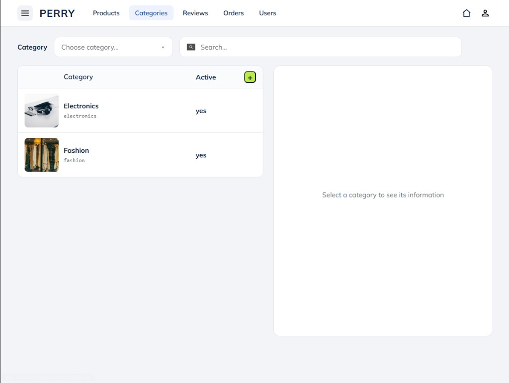

Корневые категории, Active, создание «+».

### 04 · Admin Reviews

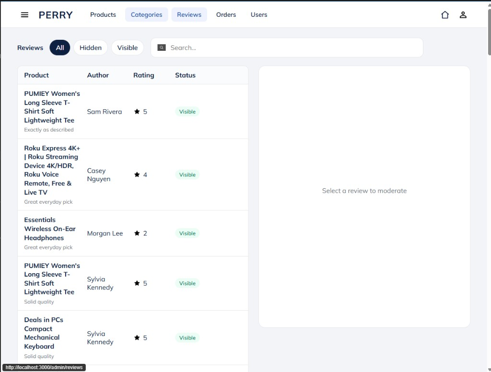

Модерация: All / Hidden / Visible.

### 05 · Admin Orders


Список заказов Date / Customer / Status / Total.

### 06 · Admin Users

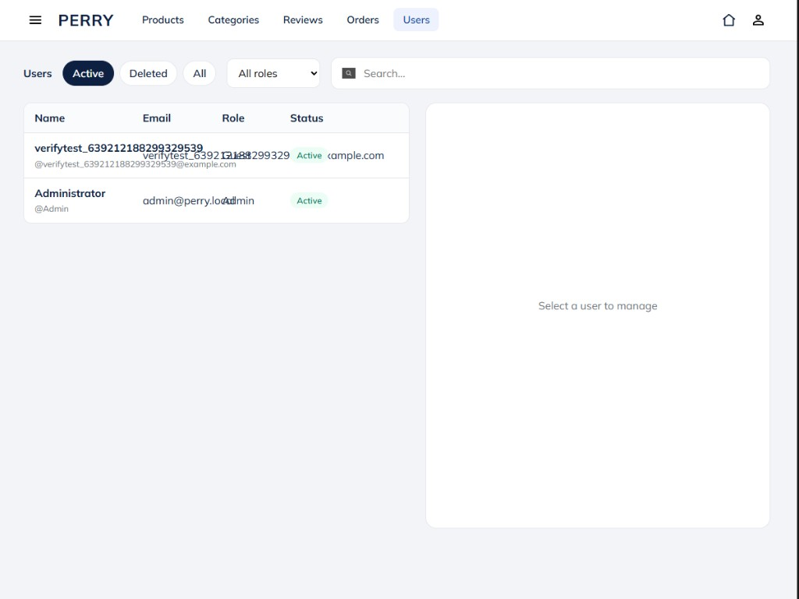

Фильтры Active / Deleted / All + role.

### 07 · Admin Products — category dropdown


Иерархия категорий в тулбаре.

### 08 · Admin Products — фильтр Streaming


Отфильтрованный список (Roku Express 4K+).

### 09 · Admin Users — Active


Активные пользователи, ellipsis на длинных email.

### 10 · Admin Orders — детали


Состав заказа + смена Status.

### 11 · Admin Reviews — Hide

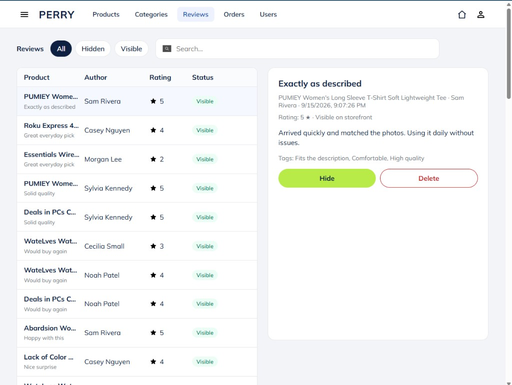

Скрыть отзыв с витрины (Hide / Delete).

### 12 · Account — My orders

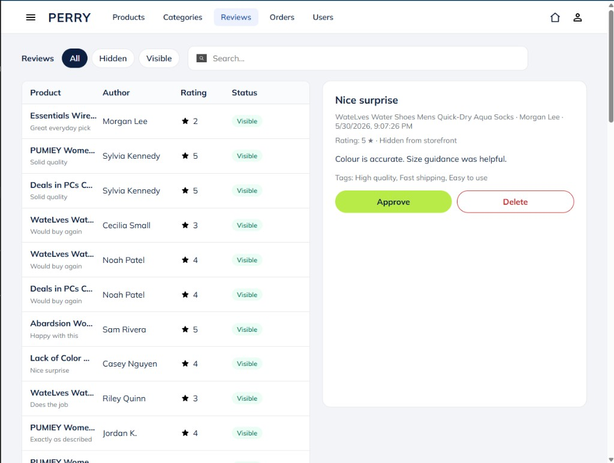

Кабинет: заказы Ordered / Ready for pickup.

### 13 · Admin Reviews — Approve


Вернуть скрытый отзыв (Approve / Delete).

### 14 · Account — Order details


Модалка: позиции, Total, How to cancel.

### 15 · Account — Order details #2

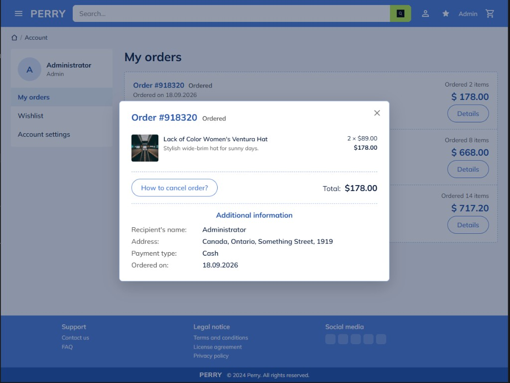

Второй заказ (#918320), Total $178.

### 16 · Account — Change email


Смена email: пароль + 6-digit code + Send code.

---

## Account (17.09.2026)

Личный кабинет покупателя (Wishlist / My orders / Account settings) — FE+BE по макетным скринам.

- Документ: [docs/ИЗМЕНЕНИЯ-Account-2026-09-17.md](./docs/ИЗМЕНЕНИЯ-Account-2026-09-17.md)
- Скриншоты (14 шт.): [docs/screenshots/README.md](./docs/screenshots/README.md)
- API: /api/wishlist, /api/auth/me, /api/auth/me/password, /api/auth/me/email, /api/orders


| **Change password** | Модалка смены пароля |  |
| **Change email** | Email + OTP | 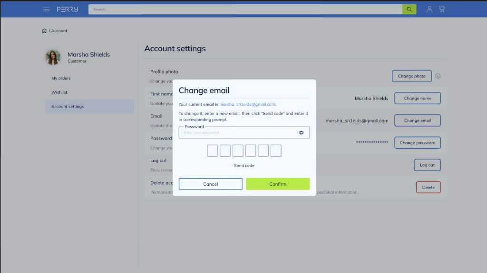 |
| **Delete account** | Подтверждение удаления | 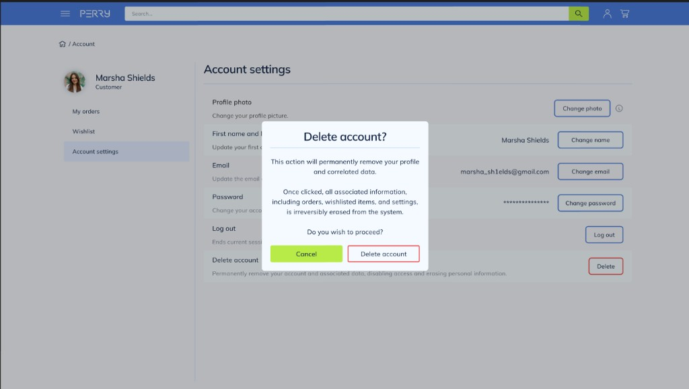 |

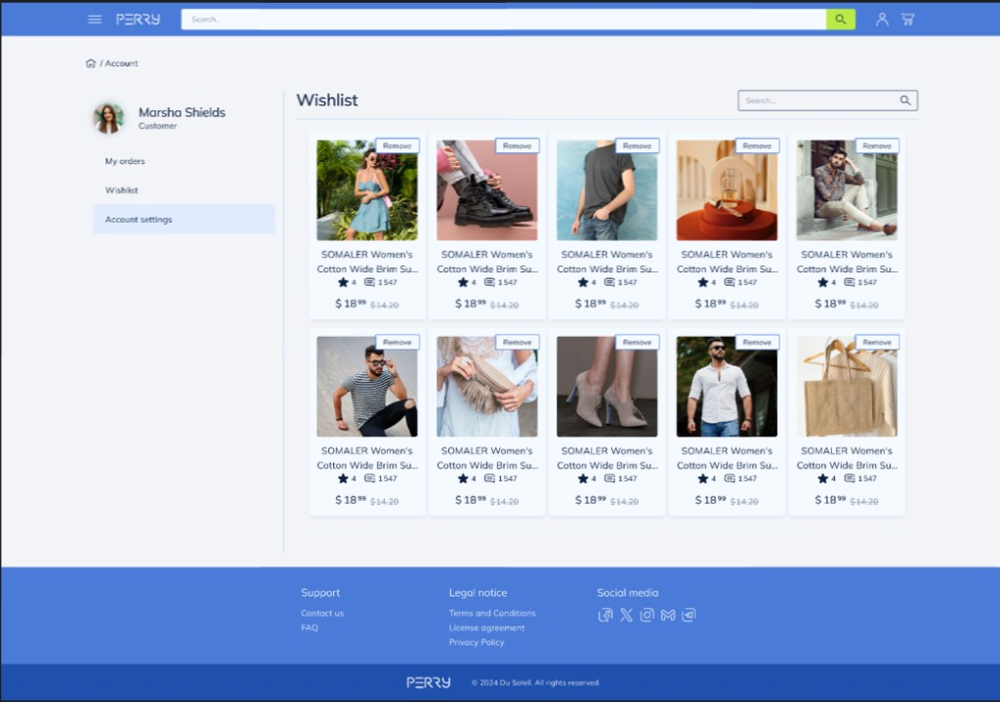

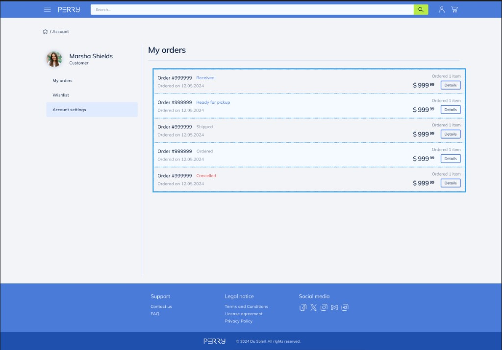

Актуальная галерея: витрина/auth/legal + **14 Account** в `docs/screenshots/account/`.

---

## Что сделано недавно

**19.09:** [docs/ИЗМЕНЕНИЯ-2026-09-19.md](./docs/ИЗМЕНЕНИЯ-2026-09-19.md) — админка React (#65–#69), PDP (#34, #36–#40), notify (#29/#30), Docker (#5), Swagger (#76).

Ранее **17.09:** **[docs/ИЗМЕНЕНИЯ-2026-09-17.md](./docs/ИЗМЕНЕНИЯ-2026-09-17.md)**. Кратко по блокам:

### Категории (закрыт пробел Create/Update)
- В entity и БД: `Description`, `ImageUrl`, `IconUrl`, `IsActive`.
- Миграция `AddCategoryDescriptionAndIconUrl`.
- `POST/PUT /api/categories` принимают `description`, `imageUrl`, `iconUrl`, `isActive` (+ name, slug, parent, sortOrder).
- Дерево/список отдают эти поля в JSON.
- Админка Razor: `Admin/Categories` + `_CategoryTreeItem`.

### Каталог API (Figma Product List V2)
- Фильтры: `brands`, `fabrics`, `sizes`, `colors`, `minPrice`/`maxPrice`, `minRating`.
- Ответ списка: блок **`facets`** (опции для сайдбара).
- Fabric / Size / Color — из атрибутов товара.

### PDP API
- `GET /api/products/{id}`: reviews, related, saleRelated, about, attributes, images, discount.

### Auth / Orders / Users API
- JWT (`JwtTokenService`), `AuthController` (login / register / forgot).
- `OrdersController`, `UsersController`, JwtBearer + CORS в `Program.cs`.

### Razor-витрина (эталон под Figma)
- Home (hero, категории, Trending, Sale, CTA Abundance of goods).
- Product List с фильтрами Brand / Fabric / Size / Color / Price / reviews.
- Product Page: галерея, buy-box (Delivery / Payment / Security / Returns), reviews, «You may also like», «Best sellers in …».
- Legal: `/Terms`, `/License`, `/Privacy` + `_LegalNav`.
- `site.css`, иконки, home images, `catalog.js` / `home.js` / `pdp.js`, расширенный DbSeeder.

### React-порт
- Витрина в [perry-front](https://github.com/ITSTEP-PERRY/perry-front) ветка `feature/figma-storefront-port` — те же экраны и стили.

### Ранее в проекте
- Ребрендинг **DuSoleil → Perry**.
- Auth UX: Welcome back, Create account, VerifyCode, Forgot/Reset, Finishing touches, Congratulations.
- Ребрендинг **DuSoleil → Perry** (solution, проекты, namespaces, БД, UI).
- UI входа и регистрации по макету команды ([perry-front](https://github.com/ITSTEP-PERRY/perry-front.git)): Welcome back + Create account, валидация полей.
- **VerifyCode:** после 3 неудачных попыток входа — 6-значный код (stub SMTP), экран `/Account/VerifyCode`.
- **Forgot / Reset password:** `/Account/ForgotPassword` → `/Account/ResetPassword` → Congratulations.
- **Finishing touches** после Register + экран **Congratulations!**
- **Витрина по макету:** главная (hero-слайдер, категории, Trending deals, CTA), Product List с фильтрами, Product Page (галерея, About, buy-box, reviews, related).
- **Legal pages:** `/Terms`, `/License`, `/Privacy` + sidebar Legal notice.
- Документы: категории, архитектура каталога, восстановление пароля, советы к защите.

---

## Скриншоты

Подробные описания: **[docs/screenshots/README.md](./docs/screenshots/README.md)**  
Сценарии Forgot/Reset/Finishing: **[docs/ВОССТАНОВЛЕНИЕ-ПАРОЛЯ.md](./docs/ВОССТАНОВЛЕНИЕ-ПАРОЛЯ.md)**

| Экран | Описание | Превью |
|-------|----------|--------|
| **Главная (витрина)** | Hero Sale, категории, Trending deals | 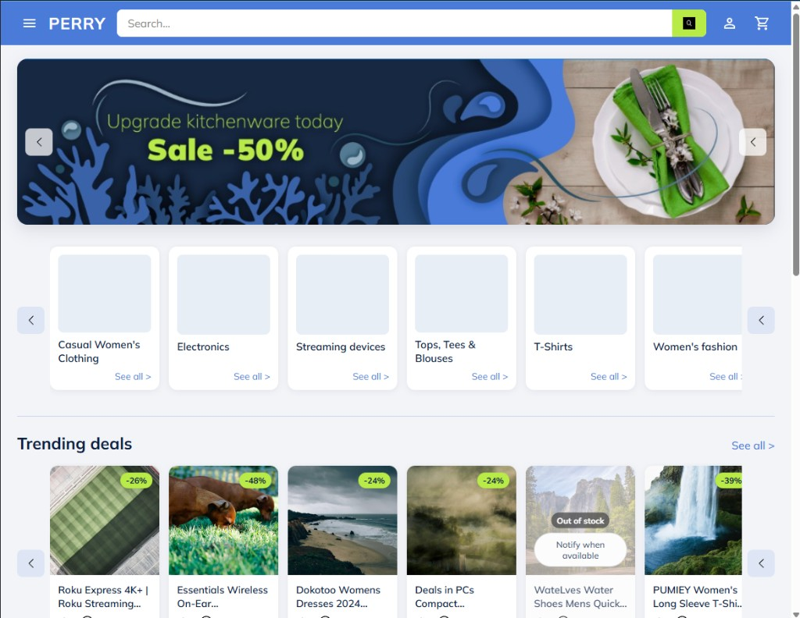 |
| **Product Page** | Галерея, About, buy-box, Product details |  |
| **Каталог + фильтры** | Material / Size / Color, grid |  |
| **Customer reviews** | Сводка, tags, Helpful / Translate | 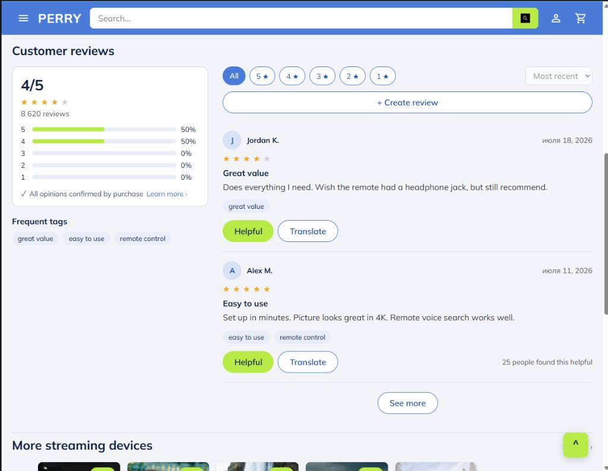 |
| **Related + footer** | Fashion: sale и подвал | 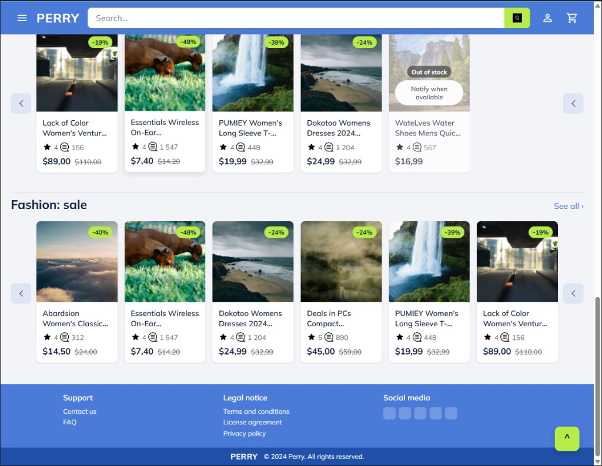 |
| **Terms** | Terms and conditions | 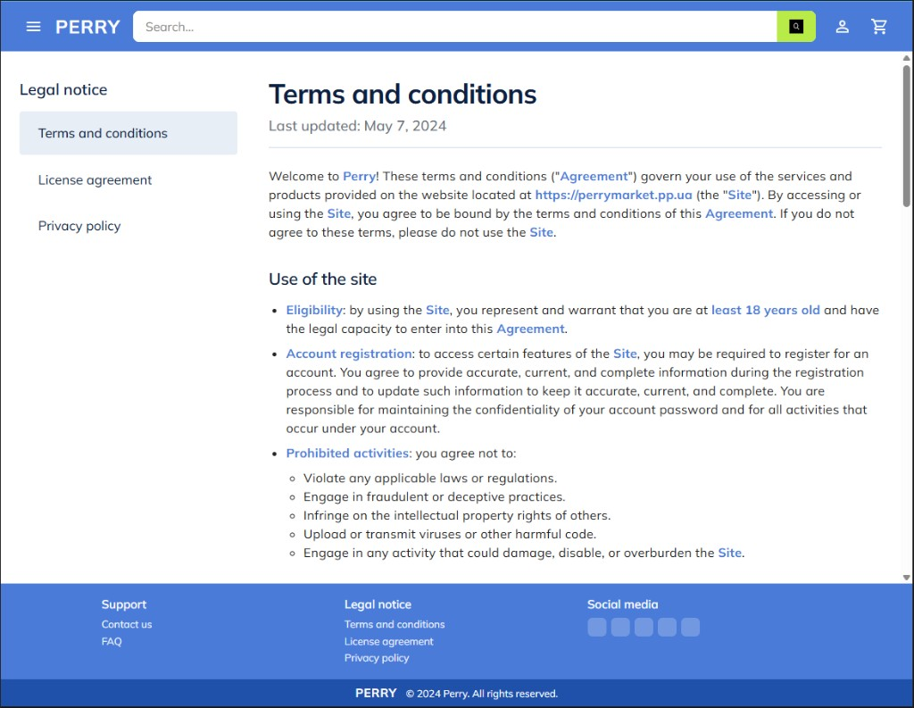 |
| **License** | License agreement | 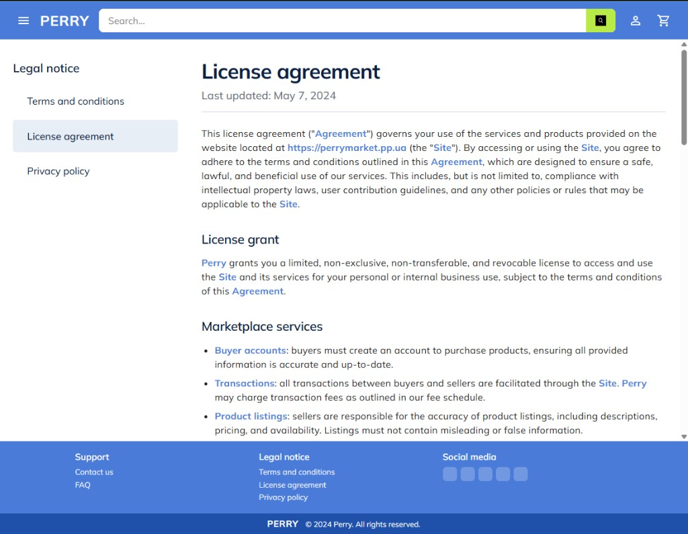 |
| **Privacy** | Privacy policy |  |
| Sign in (старый кадр) | Ранний кадр входа |  |
| **Welcome back** | Вход покупателя (Email / Password) |  |
| Welcome back — ошибки | Пустые поля: сообщения валидации |  |
| **Create account** | Регистрация Email + Password + Confirm |  |
| Create account — ошибки | Неверный email / слабый пароль / mismatch |  |
| **Send code** (пусто) | 6 полей кода после 3 fails Login |  |
| Send code — ввод + таймер | Код введён, Resend 0:59 |  |
| Send code — ошибка | Incorrect code, try again |  |
| **Forgot password** | Ввод email для сброса пароля | 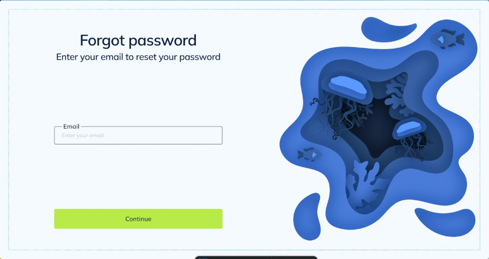 |
| Forgot password — ошибка | Wrong or invalid email address |  |
| **Reset password** | New password + Repeat password |  |
| Reset password — ошибки | Necessary to continue / Passwords must match |  |
| **Finishing touches** | First name + Last name после Register |  |
| Finishing touches — ошибки | First/Last name is required | 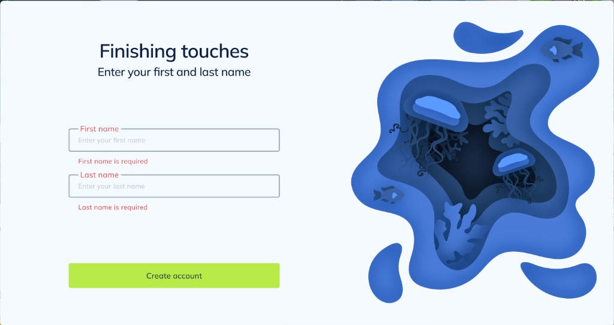 |
| **Congratulations!** | Успех регистрации или сброса пароля |  |


## Скриншоты Account (14 новых)

Полные описания и превью: **[docs/screenshots/README.md](./docs/screenshots/README.md)** (секция Account).

| # | Экран | Файл |
|---|--------|------|
| A01 | Wishlist | [01-wishlist.png](./docs/screenshots/account/01-wishlist.png) |
| A02 | Wishlist — Remove confirm | [02-wishlist-remove-modal.png](./docs/screenshots/account/02-wishlist-remove-modal.png) |
| A03 | My orders | [03-my-orders.png](./docs/screenshots/account/03-my-orders.png) |
| A04 | Account settings — photo tip | [04-account-settings-photo-tip.png](./docs/screenshots/account/04-account-settings-photo-tip.png) |
| A05 | Order details (Ordered) | [05-order-details-modal.png](./docs/screenshots/account/05-order-details-modal.png) |
| A06 | Order details (Received) | [06-order-details-received.png](./docs/screenshots/account/06-order-details-received.png) |
| A07 | Account settings | [07-account-settings.png](./docs/screenshots/account/07-account-settings.png) |
| A08 | Change name | [08-change-name-modal.png](./docs/screenshots/account/08-change-name-modal.png) |
| A09 | Change password | [09-change-password-modal.png](./docs/screenshots/account/09-change-password-modal.png) |
| A10 | Change password — validation | [10-change-password-validation.png](./docs/screenshots/account/10-change-password-validation.png) |
| A11 | Change email | [11-change-email-modal.png](./docs/screenshots/account/11-change-email-modal.png) |
| A12 | Change email — validation | [12-change-email-validation.png](./docs/screenshots/account/12-change-email-validation.png) |
| A13 | Log out? | [13-logout-confirm.png](./docs/screenshots/account/13-logout-confirm.png) |
| A14 | Delete account? | [14-delete-account-confirm.png](./docs/screenshots/account/14-delete-account-confirm.png) |


