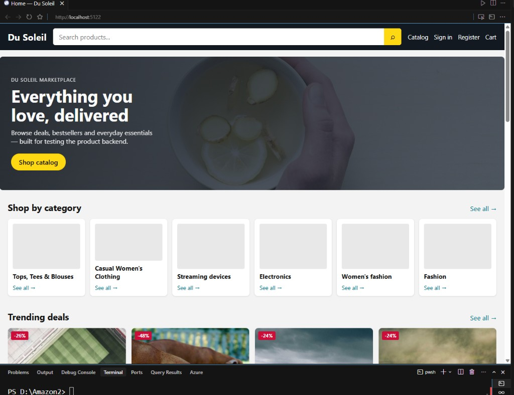
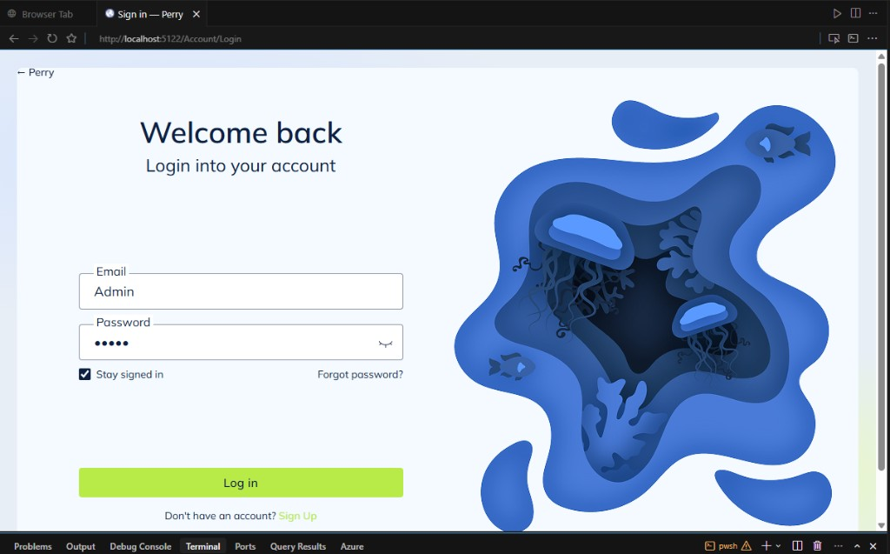
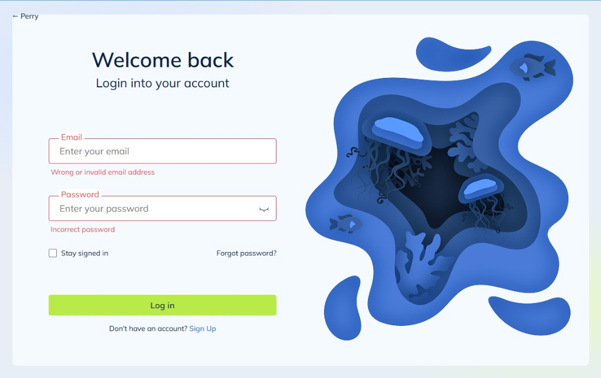
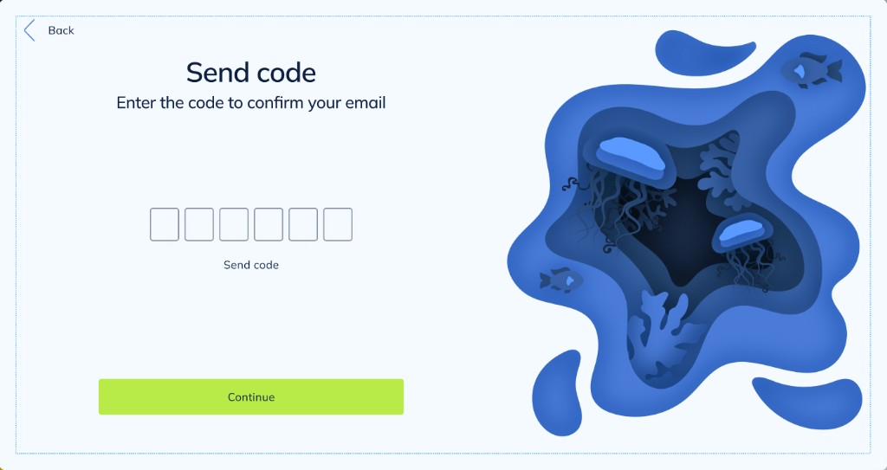
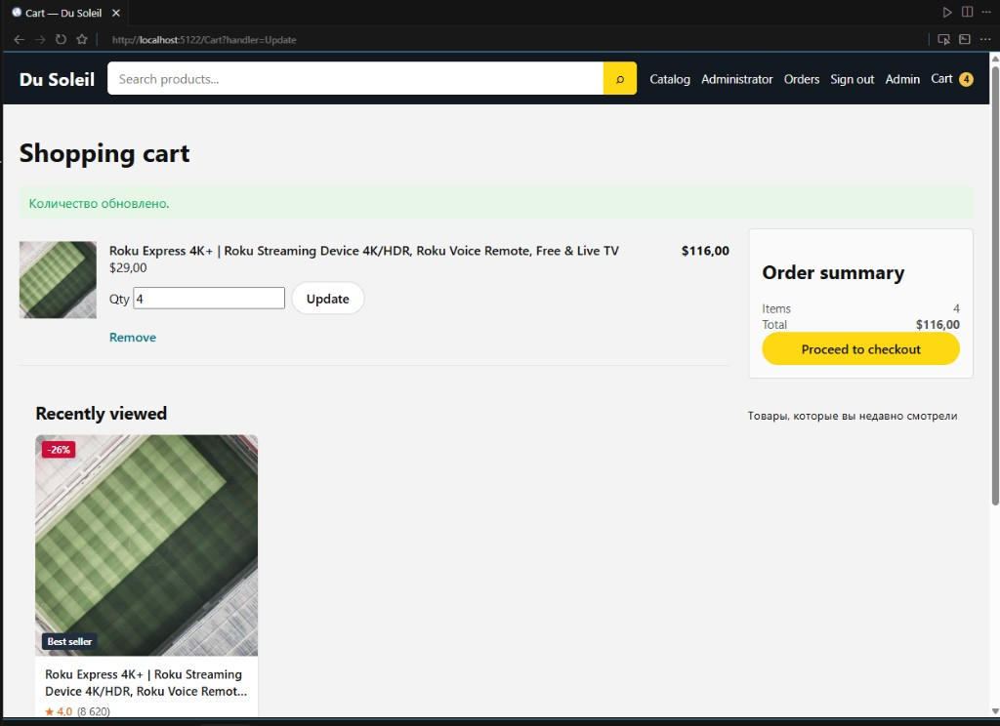
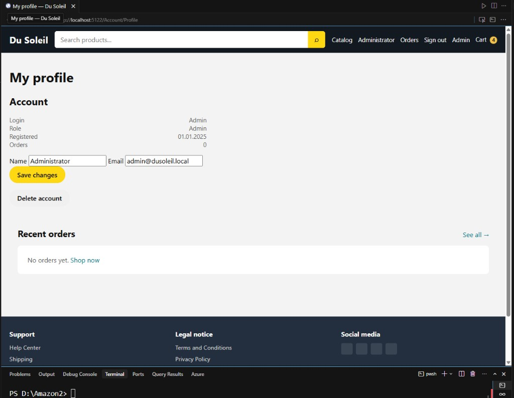
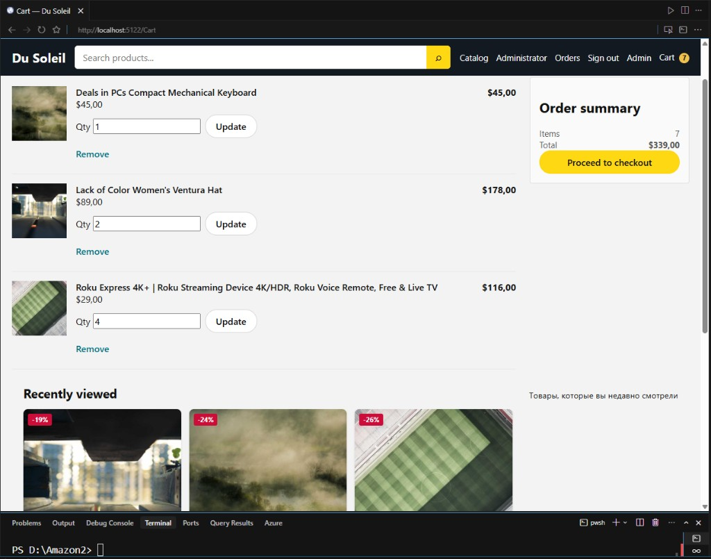

# Perry

Дипломный маркетплейс **Perry** на **ASP.NET Core 8** — витрина + админка + REST API.
Рабочее название совпадает с фронтом команды: [perry-front](https://github.com/ITSTEP-PERRY/perry-front.git).
Проекты решения: `Perry.Domain`, `Perry.Infrastructure`, `Perry.Web`, `Perry.Api`.

## Документация

Этот README — краткий обзор. **Подробности по архитектуре, клиентской части, запуску и интеграциям** лежат в папке **[docs/](./docs/)** (начни с [docs/README.md](./docs/README.md)).

| Файл | О чём |
|------|--------|
| [docs/README.md](./docs/README.md) | Оглавление и быстрый старт |
| [docs/ПРОДЕЛАННАЯ-РАБОТА.md](./docs/ПРОДЕЛАННАЯ-РАБОТА.md) | Архитектура, сущности, API, витрина, чеклист |
| [docs/КАТЕГОРИИ.md](./docs/КАТЕГОРИИ.md) | Categories: таблица, seed, JSON API, витрина |
| [docs/КЛИЕНТСКАЯ-ЧАСТЬ.md](./docs/КЛИЕНТСКАЯ-ЧАСТЬ.md) | Дерево Account / Cart / Orders / Auth (покупатель) |
| [docs/КАК-ВЫПОЛНЯТЬ-ЗАДАНИЕ.md](./docs/КАК-ВЫПОЛНЯТЬ-ЗАДАНИЕ.md) | Запуск, smoke-тесты, что доделать по желанию |
| [docs/ИНТЕГРАЦИЯ-HOMEWORK-АДМИНКА.md](./docs/ИНТЕГРАЦИЯ-HOMEWORK-АДМИНКА.md) | Что перенесено из homework |

## Запуск

```bash
dotnet run --project src/Perry.Web --launch-profile http
```

Открывай **http://localhost:5122/** (не https — иначе браузер может показать «нет доступа»).

- Админ: `/Admin/Login` — `Admin` / `Admin`  
- API: `dotnet run --project src/Perry.Api` → `/swagger`

БД: `(localdb)\mssqllocaldb` → `Perry`.

## Что сделано недавно

- Ребрендинг **DuSoleil → Perry** (solution, проекты, namespaces, БД, UI).
- UI входа и регистрации по макету команды ([perry-front](https://github.com/ITSTEP-PERRY/perry-front.git)): Welcome back + Create account, валидация полей.
- **VerifyCode:** после 3 неудачных попыток входа — 6-значный код (stub SMTP / опционально Gmail), экран `/Account/VerifyCode`.
- Подробности: [docs/ПРОДЕЛАННАЯ-РАБОТА.md](./docs/ПРОДЕЛАННАЯ-РАБОТА.md) §11.

## Скриншоты

Подробные описания: **[docs/screenshots/README.md](./docs/screenshots/README.md)**

| Экран | Превью |
|-------|--------|
| Главная |  |
| Каталог + фильтры |  |
| Sign in (старый кадр) |  |
| **Welcome back** |  |
| Welcome back — ошибки |  |
| **Create account** |  |
| Create account — ошибки |  |
| **Send code** (пусто) |  |
| Send code — ввод + таймер |  |
| Send code — ошибка |  |
| Admin Dashboard |  |
| Admin категории/товары |  |
| Admin Users |  |
| Product Page + Add to cart |  |
| Cart |  |
| Profile |  |
| Related / Best sellers |  |
| Cart (несколько позиций) |  |
