# Perry (Teslyar75)

Product API + **актуальная** Desktop-витрина (Figma) + Mobile (Expo).

Старый Razor-фронт **`Perry.Web` удалён**. Запускается только **React** (`frontend/`, порт **3000**), не `:5122` и не `dotnet run --project src/Perry.Web`.

## Быстрый запуск с ярлыка (после clone)

1. Установите **[.NET 8 SDK](https://dotnet.microsoft.com/download/dotnet/8.0)**, **[Docker Desktop](https://www.docker.com/products/docker-desktop/)**, **[Node.js 18+](https://nodejs.org/)**.  
2. `git clone https://github.com/Teslyar75/My_Amazon2.git` → откройте папку клона.  
3. Дважды кликните **`Create-Shortcuts.cmd`** (или `Создать-ярлык.cmd`).  
4. Порядок запуска: **Perry API** → затем **Perry Desktop** и/или **Perry Mobile**.  

Если скрипт ярлыков ругался на кодировку — сделайте `git pull` и используйте именно **`Create-Shortcuts.cmd`** (ASCII, без поломки PowerShell).

| Ярлык / скрипт | Что | URL |
|----------------|-----|-----|
| **Perry API** · `start-api.cmd` | Postgres + Product API | http://localhost:5272/swagger |
| **Perry Desktop** · `start-desktop.cmd` | Витрина Figma (Vite) в `frontend/` | http://localhost:3000 |
| **Perry Mobile** · `start-mobile.cmd` | Expo Web в `mobile/` | http://localhost:8081 |

Инструкция API: [docs/инструкции/КАК-ЗАПУСКАТЬ-API.md](./docs/инструкции/КАК-ЗАПУСКАТЬ-API.md) · frontend: [frontend/README.md](./frontend/README.md)

---

## Вайбкодинг — пакет документов

Собрать Perry с нуля через Cursor / ИИ: папка **[`vibe-prompts/`](./vibe-prompts/README.md)**.

| Документ | О чём |
|----------|--------|
| **[vibe-prompts/README.md](./vibe-prompts/README.md)** | Оглавление промптов `00`→`12`, правила стека |
| [PITFALLS.md](./vibe-prompts/PITFALLS.md) | Грабли дизайна и стыков (цены, Auth, reviews, footer) |
| [AGENTS-AND-SEQUENCE.md](./vibe-prompts/AGENTS-AND-SEQUENCE.md) | Сколько агентов и порядок фаз |
| [HOW-TO-RUN-SEQUENCE.md](./vibe-prompts/HOW-TO-RUN-SEQUENCE.md) | Как гонять сценарий по шагам |
| [run-vibe-sequence.cmd](./vibe-prompts/run-vibe-sequence.cmd) | Автосценарий: копирует промпт в буфер → вставка в Agent |
| [Отчёт 03.10.2026](./docs/журнал/2026-10-03.md) | День появления пакета (Auth · отзывы · цены · vibe-prompts) |
| [Отчёт 04.10.2026](./docs/журнал/2026-10-04.md) | Translate · фото отзывов · checkout города / демо-оплата |
| [Отчёт 04.10.2026 (вечер)](./docs/журнал/2026-10-04-account-avatar.md) | Аватар профиля · имя в отзывах · админ-дашборд · 401 |
| [Отчёт 04.10.2026 (checkout · админ)](./docs/журнал/2026-10-04-checkout-admin.md) | Города по областям · память адреса/карты · сессия · аватар админа |

Старт: двойной клик **`vibe-prompts/run-vibe-sequence.cmd`** (или читай `PITFALLS` → `00-vision` → далее по ссылкам).

---

Бэкенд: **ASP.NET Core 8** (`Perry.Domain` · `Perry.Infrastructure` · `Perry.Api`).  
UI: папки **`frontend/`** (React/Vite под Figma) и **`mobile/`** (Expo).

| | |
|--|--|
| **Доска Trello** | https://trello.com/b/bwEYs3Kq/itstep-perry |
| **Auth Service** | https://github.com/ITSTEP-PERRY/Backend-client |
| **Командный mirror API** | https://github.com/ITSTEP-PERRY/Back_end_for_our_poroject |
| **Защита: Product API (без админки)** | **[project_defense/DEFENSE_BACKEND.md](./project_defense/DEFENSE_BACKEND.md)** |
| **Словарик аббревиатур** | [GLOSSARY-BACKEND.md](./project_defense/GLOSSARY-BACKEND.md) · [СЛОВАРИК-БЭКЕНД.md](./project_defense/СЛОВАРИК-БЭКЕНД.md) |
| **Вайбкодинг** | **[vibe-prompts/](./vibe-prompts/README.md)** |

---

## Как читать (гайд для студента)

0. **Отчёт перед комиссией (бэкенд):** **[project_defense/DEFENSE_BACKEND.md](./project_defense/DEFENSE_BACKEND.md)** — архитектура, слайды, Trello Done, словарик в конце файла · индекс материалов защиты: [project_defense/README.md](./project_defense/README.md)  
1. **[docs/ГАЙД-ДЛЯ-СТУДЕНТА.md](./docs/ГАЙД-ДЛЯ-СТУДЕНТА.md)** — шаги, как собрать похожий проект  
2. **Вайбкодинг (промпты для ИИ):** **[vibe-prompts/README.md](./vibe-prompts/README.md)**  
3. Ниже — **вся документация по дням**, затем **по темам**, затем **скрины с описанием**  
4. Этапы целиком: **[docs/ХРОНИКА-РАБОТЫ.md](./docs/ХРОНИКА-РАБОТЫ.md)**  
5. Папки: `журнал/` · `инструкции/` · `стыки/` · `продукт/` · `screenshots/` · `vibe-prompts/`  
6. **Готовность (02.10):** [продукт/ГОТОВНОСТЬ-ПРОЕКТА-2026-10-02.md](./docs/продукт/ГОТОВНОСТЬ-ПРОЕКТА-2026-10-02.md) · [ЧТО-ЕЩЁ-СДЕЛАТЬ.md](./docs/продукт/ЧТО-ЕЩЁ-СДЕЛАТЬ.md)

---

## 1. Документация по дням (журнал)

Единая лента: раньше «ИЗМЕНЕНИЯ» и «ОТЧЁТ» — одно и то же. Читать сверху вниз.

| Дата | Тема дня | Документ |
|------|----------|----------|
| **17.09.2026** | Каталог, PDP API, React-порт | [журнал/2026-09-17.md](./docs/журнал/2026-09-17.md) |
| 17.09.2026 | Личный кабинет (Wishlist / Orders / Settings) | [журнал/2026-09-17-account.md](./docs/журнал/2026-09-17-account.md) |
| **19.09.2026** | Спринт к защите (админка, PDP, Docker, smoke) | [журнал/2026-09-19.md](./docs/журнал/2026-09-19.md) |
| **25.09.2026** | AuthTokens, lightbox, корзина по JWT | [журнал/2026-09-25.md](./docs/журнал/2026-09-25.md) |
| 25.09.2026 | Admin Orders: фильтры и статистика | [журнал/2026-09-25-orders-stats.md](./docs/журнал/2026-09-25-orders-stats.md) |
| **26.09.2026** | Users вынесены в Auth; JWT; две линии фронта | [журнал/2026-09-26.md](./docs/журнал/2026-09-26.md) |
| 26.09.2026 | Срез деталей того же дня | [журнал/2026-09-26-срез.md](./docs/журнал/2026-09-26-срез.md) |
| **28.09.2026** | Seed заказов, reviews API, checkout, health, popular | [журнал/2026-09-28.md](./docs/журнал/2026-09-28.md) |
| 28.09.2026 | Срез backend-задач дня + CI | [журнал/2026-09-28-a03-a07.md](./docs/журнал/2026-09-28-a03-a07.md) |
| 28.09.2026 | Общий JWT-секрет Auth → Product | [журнал/2026-09-28-auth-95.md](./docs/журнал/2026-09-28-auth-95.md) |
| **29.09.2026** | Internal Auth, Reviews, Dev Admin | [журнал/2026-09-29.md](./docs/журнал/2026-09-29.md) |
| 29.09.2026 | PostgreSQL + admin orders | [журнал/2026-09-29-a08-a09.md](./docs/журнал/2026-09-29-a08-a09.md) |
| 29.09.2026 | Orders: last update / смена статуса | [журнал/2026-09-29-a10.md](./docs/журнал/2026-09-29-a10.md) |
| **30.09.2026** | SellerId, OrderNumber, письма по заказу | [журнал/2026-09-30-a11-a13.md](./docs/журнал/2026-09-30-a11-a13.md) |
| **01.10.2026** | Mobile Expo под Figma + CORS `:8081` | [журнал/2026-10-01.md](./docs/журнал/2026-10-01.md) |
| 01.10.2026 | Mobile: сверка окон с макетом | [журнал/2026-10-01-mobile-figma-1в1.md](./docs/журнал/2026-10-01-mobile-figma-1в1.md) |
| 01.10.2026 | Mobile: аудит ссылок и навигации | [журнал/2026-10-01-mobile-аудит.md](./docs/журнал/2026-10-01-mobile-аудит.md) |
| **02.10.2026** | DummyJSON: реальные фото витрин по разделам | [журнал/2026-10-02.md](./docs/журнал/2026-10-02.md) |
| 02.10.2026 | Готовность проекта + открытый бэклог | [готовность](./docs/продукт/ГОТОВНОСТЬ-ПРОЕКТА-2026-10-02.md) · [бэклог](./docs/продукт/ЧТО-ЕЩЁ-СДЕЛАТЬ.md) |
| **03.10.2026** | Auth · отзывы · цены · vibe-prompts | [журнал/2026-10-03.md](./docs/журнал/2026-10-03.md) |
| **04.10.2026** | Translate · фото отзывов · checkout | [журнал/2026-10-04.md](./docs/журнал/2026-10-04.md) |
| 04.10.2026 | Аккаунт: аватар · имя в отзывах · админ-дашборд · 401 | [журнал/2026-10-04-account-avatar.md](./docs/журнал/2026-10-04-account-avatar.md) |
| 04.10.2026 | Checkout города · память адреса/карты · сессия · аватар админа | [журнал/2026-10-04-checkout-admin.md](./docs/журнал/2026-10-04-checkout-admin.md) |

Оглавление журнала: [docs/журнал/README.md](./docs/журнал/README.md).

---

## 2. Документация по темам

### Вайбкодинг

| Документ | О чём |
|----------|--------|
| [vibe-prompts/README.md](./vibe-prompts/README.md) | Пакет промптов для сборки Perry через ИИ |
| [vibe-prompts/PITFALLS.md](./vibe-prompts/PITFALLS.md) | Сложности дизайна и интеграции |
| [vibe-prompts/AGENTS-AND-SEQUENCE.md](./vibe-prompts/AGENTS-AND-SEQUENCE.md) | Агенты и порядок фаз |
| [vibe-prompts/HOW-TO-RUN-SEQUENCE.md](./vibe-prompts/HOW-TO-RUN-SEQUENCE.md) | Скрипт последовательного запуска |
| [vibe-prompts/run-vibe-sequence.cmd](./vibe-prompts/run-vibe-sequence.cmd) | Старт сценария |

### Запуск и эксплуатация

| Документ | О чём |
|----------|--------|
| [инструкции/КАК-ЗАПУСКАТЬ-API.md](./docs/инструкции/КАК-ЗАПУСКАТЬ-API.md) | **Запуск этого репо (Product API)** |
| [инструкции/КАК-ЗАПУСКАТЬ.md](./docs/инструкции/КАК-ЗАПУСКАТЬ.md) | Desktop + Mobile витрина (ярлыки FE) |
| [инструкции/НАПОЛНЕНИЕ-ФОТО-DUMMYJSON.md](./docs/инструкции/НАПОЛНЕНИЕ-ФОТО-DUMMYJSON.md) | Как залить фото витрины у себя |
| [инструкции/docker.md](./docs/инструкции/docker.md) | PostgreSQL + docker compose + env |
| [инструкции/deployment.md](./docs/инструкции/deployment.md) | Деплой |
| [инструкции/ci-cd.md](./docs/инструкции/ci-cd.md) | CI/CD |
| [инструкции/troubleshooting.md](./docs/инструкции/troubleshooting.md) | Типовые сбои |
| [инструкции/Git-WORKFLOW.md](./docs/инструкции/Git-WORKFLOW.md) | Git |
| [инструкции/КАК-ВЫПОЛНЯТЬ-ЗАДАНИЕ.md](./docs/инструкции/КАК-ВЫПОЛНЯТЬ-ЗАДАНИЕ.md) | Запуск solution и разбор кода |
| [инструкции/SMOKE-ЗАЩИТА.md](./docs/инструкции/SMOKE-ЗАЩИТА.md) | Чеклист демо |
| [инструкции/SMTP-НАСТРОЙКА.md](./docs/инструкции/SMTP-НАСТРОЙКА.md) | Stub → Gmail App Password |
| [инструкции/РЕЧЬ-SMTP-ДЕМО.md](./docs/инструкции/РЕЧЬ-SMTP-ДЕМО.md) | Речь на защиту |
| [инструкции/ВОССТАНОВЛЕНИЕ-ПАРОЛЯ.md](./docs/инструкции/ВОССТАНОВЛЕНИЕ-ПАРОЛЯ.md) | Forgot / Reset / Finishing |
| [инструкции/TRELLO-TODO.md](./docs/инструкции/TRELLO-TODO.md) | Статусы работ на доске |
| [инструкции/КОМАНДА-КАРТОЧКИ-TRELLO.md](./docs/инструкции/КОМАНДА-КАРТОЧКИ-TRELLO.md) | Обзор доски команды |

### Стыки Auth ↔ Product

| Документ | О чём |
|----------|--------|
| [стыки/СТЫКИ-МИКРОСЕРВИСОВ.md](./docs/стыки/СТЫКИ-МИКРОСЕРВИСОВ.md) | Полный разбор стыков |
| [стыки/РЕШЕНИЕ-СТЫКОВ-С-КОДОМ.md](./docs/стыки/РЕШЕНИЕ-СТЫКОВ-С-КОДОМ.md) | Что куда вставить + код |
| [стыки/AUTH-INTEGRATION.md](./docs/стыки/AUTH-INTEGRATION.md) | JWT / claims / FE |
| [стыки/СТЫКИ-ЛОКАЛЬНО.md](./docs/стыки/СТЫКИ-ЛОКАЛЬНО.md) | Локальный статус |
| [стыки/СООБЩЕНИЕ-В-ЧАТ-СТЫКИ.md](./docs/стыки/СООБЩЕНИЕ-В-ЧАТ-СТЫКИ.md) | Текст в командный чат |
| [стыки/ЗАПРОС-ВЛАДУ-97.md](./docs/стыки/ЗАПРОС-ВЛАДУ-97.md) | Internal Auth (запрос) |
| [стыки/ВОПРОСЫ-КОМАНДЕ.md](./docs/стыки/ВОПРОСЫ-КОМАНДЕ.md) | Открытые вопросы |

### Каталог, кабинет, админка, mobile

| Документ | О чём |
|----------|--------|
| [продукт/architecture.md](./docs/продукт/architecture.md) | Архитектура API |
| [продукт/КАТАЛОГ-ТОВАРОВ-АРХИТЕКТУРА.md](./docs/продукт/КАТАЛОГ-ТОВАРОВ-АРХИТЕКТУРА.md) | Product + Variants |
| [продукт/КАТЕГОРИИ.md](./docs/продукт/КАТЕГОРИИ.md) | Categories API / seed |
| [продукт/ACCOUNT-КАБИНЕТ.md](./docs/продукт/ACCOUNT-КАБИНЕТ.md) | Wishlist / Orders / Settings |
| [продукт/ОТЗЫВЫ-ПОКУПАТЕЛЕЙ.md](./docs/продукт/ОТЗЫВЫ-ПОКУПАТЕЛЕЙ.md) | Модель и API отзывов |
| [продукт/НАША-АДМИНКА.md](./docs/продукт/НАША-АДМИНКА.md) | React `/admin` |
| [продукт/ADMIN-КОМАНДА.md](./docs/продукт/ADMIN-КОМАНДА.md) | Админка команды |
| [продукт/РЕШЕНИЕ-ФРОНТ-АДМИН.md](./docs/продукт/РЕШЕНИЕ-ФРОНТ-АДМИН.md) | Разделение с командой |
| [продукт/СВЕСТИ-ДВЕ-ЛИНИИ.md](./docs/продукт/СВЕСТИ-ДВЕ-ЛИНИИ.md) | Figma-порт vs вторая линия фронта |
| [продукт/МОБИЛЬНОЕ-ПРИЛОЖЕНИЕ-REACT.md](./docs/продукт/МОБИЛЬНОЕ-ПРИЛОЖЕНИЕ-REACT.md) | План Expo / RN |
| [продукт/ГОТОВНОСТЬ-ПРОЕКТА-2026-10-02.md](./docs/продукт/ГОТОВНОСТЬ-ПРОЕКТА-2026-10-02.md) | Срез готовности + Trello (репо-источники) |
| [продукт/ЧТО-ЕЩЁ-СДЕЛАТЬ.md](./docs/продукт/ЧТО-ЕЩЁ-СДЕЛАТЬ.md) | Открытый бэклог и зачем каждая задача |

### Корень docs + скрины (оглавления)

| Документ | О чём |
|----------|--------|
| [docs/ГАЙД-ДЛЯ-СТУДЕНТА.md](./docs/ГАЙД-ДЛЯ-СТУДЕНТА.md) | Методичка |
| [docs/ХРОНИКА-РАБОТЫ.md](./docs/ХРОНИКА-РАБОТЫ.md) | Хроника этапов |
| [docs/README.md](./docs/README.md) | Оглавление папок |
| [docs/screenshots/README.md](./docs/screenshots/README.md) | Скрины 04.10 (29 шт., с подписями) |
| [docs/screenshots/2026-10-04/README.md](./docs/screenshots/2026-10-04/README.md) | Каталог с превью |
| [`project_defense/`](./project_defense/) | Схемы архитектуры к защите |

---

## 3. Быстрый запуск

### Product API

```bash
cp .env.example .env
docker compose up -d postgres
dotnet run --project src/Perry.Api --launch-profile http
```

- Swagger: http://localhost:5272/swagger  
- Health: http://localhost:5272/api/health  

### Витрина (perry-front)

| Ярлык | URL |
|-------|-----|
| **Perry Desktop** | http://localhost:3000 |
| **Perry Mobile** | http://localhost:8081 |

`powershell -ExecutionPolicy Bypass -File .\Install-Perry-Shortcuts.ps1`  
Нужен API на **`:5272`**. Секреты — только в локальном `.env`.

---

## Скриншоты витрины (04.10.2026)

Актуальные кадры: главная → каталог → товар → корзина/checkout → кабинет → legal → админка.  
Таблица и полный каталог: [docs/screenshots/README.md](./docs/screenshots/README.md) · [2026-10-04](./docs/screenshots/2026-10-04/README.md).

### Главная

#### 01 · Home — hero + Trending deals


Hero «Sale -50%», категории, Trending deals.

#### 02 · Home — Welcome back

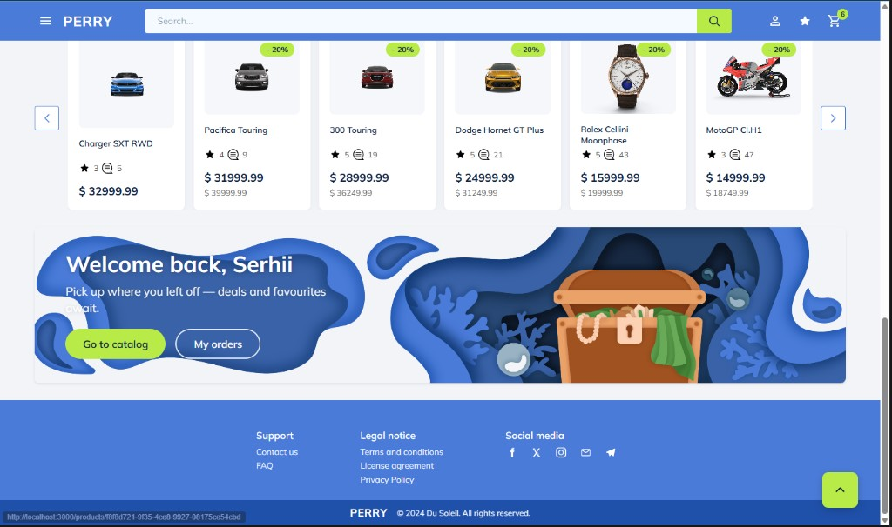

Персональный CTA: Go to catalog / My orders.

#### 03 · Home — Women's fashion: sale


Карусель Sale + футер.

#### 04 · Home — меню категорий

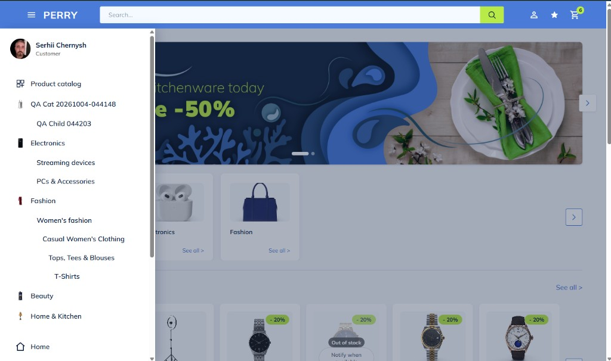

Аватар + дерево категорий.

#### 05 · Home — меню аккаунта


Cart / Orders / Wishlist / Settings / Log out.

### Каталог

#### 06 · Fashion

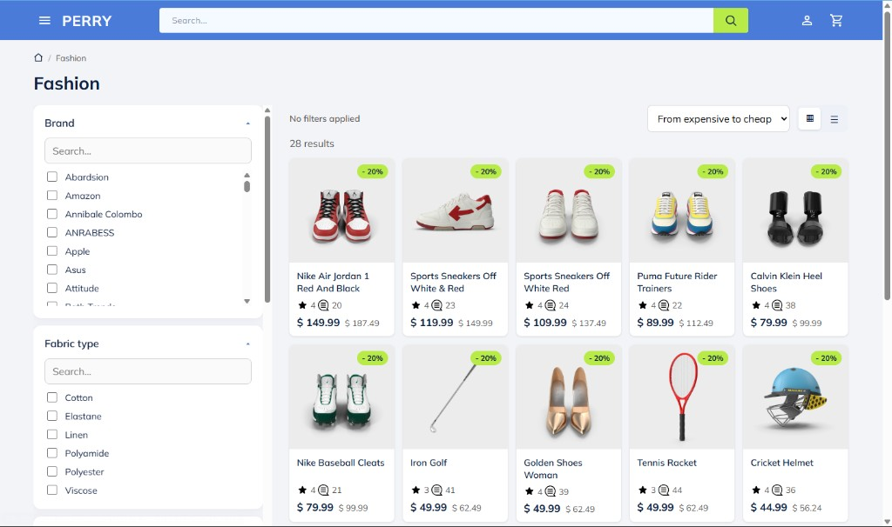

Сетка товаров, фильтры Brand / Fabric type.

### Страница товара

#### 07 · Product page

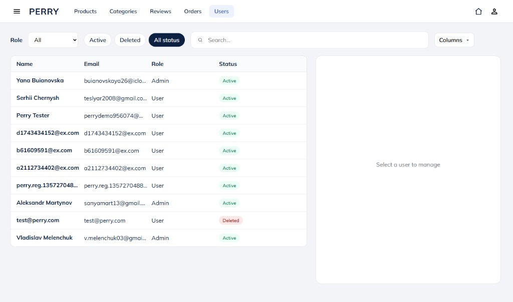

Nike Air Jordan 1: галерея, Buy now / Add to cart.

#### 08 · Lightbox фото

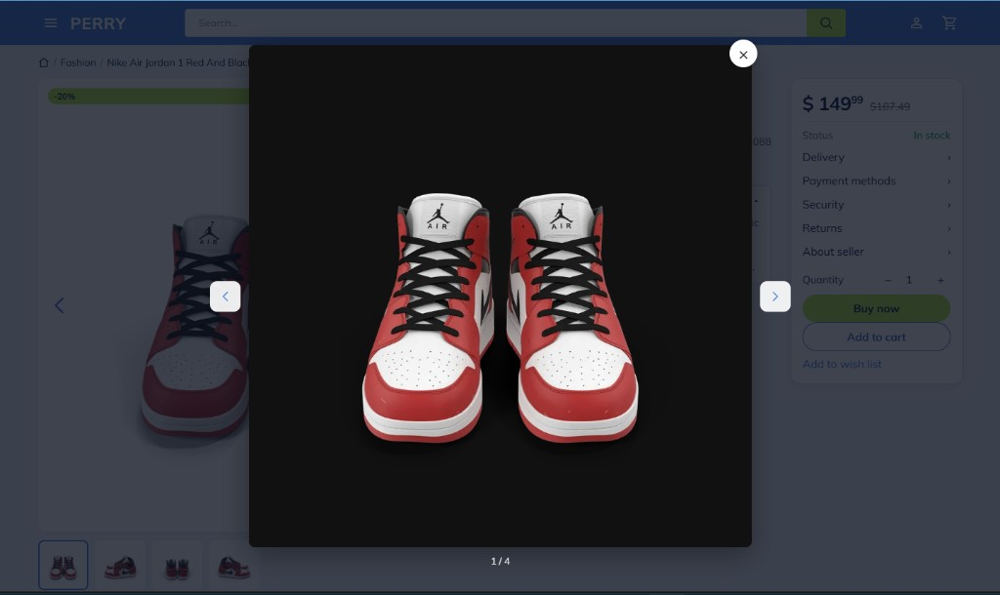

Полноэкранный просмотр (1/4).

#### 09 · Specs + отзывы на PDP


Характеристики и блок Customer reviews.

#### 10 · Customer reviews

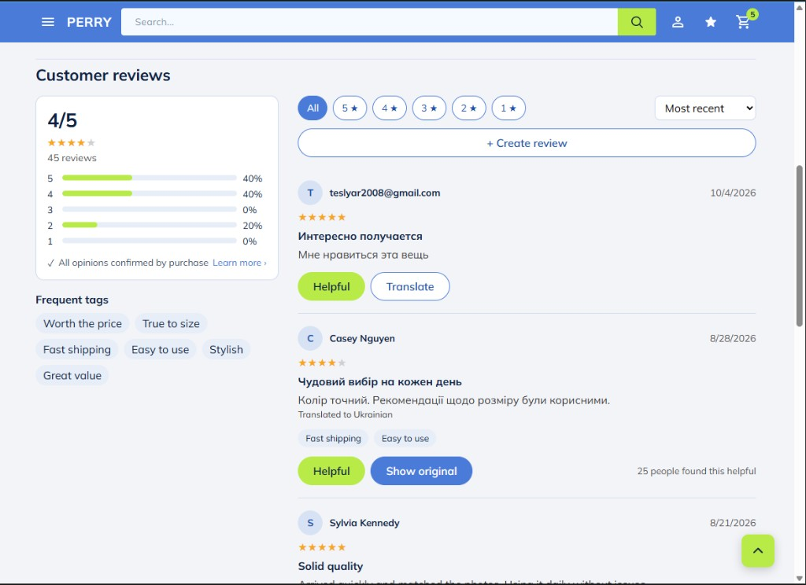

Рейтинг, теги, Create review, Helpful / Translate.

### Корзина и Checkout

#### 11 · Shopping cart

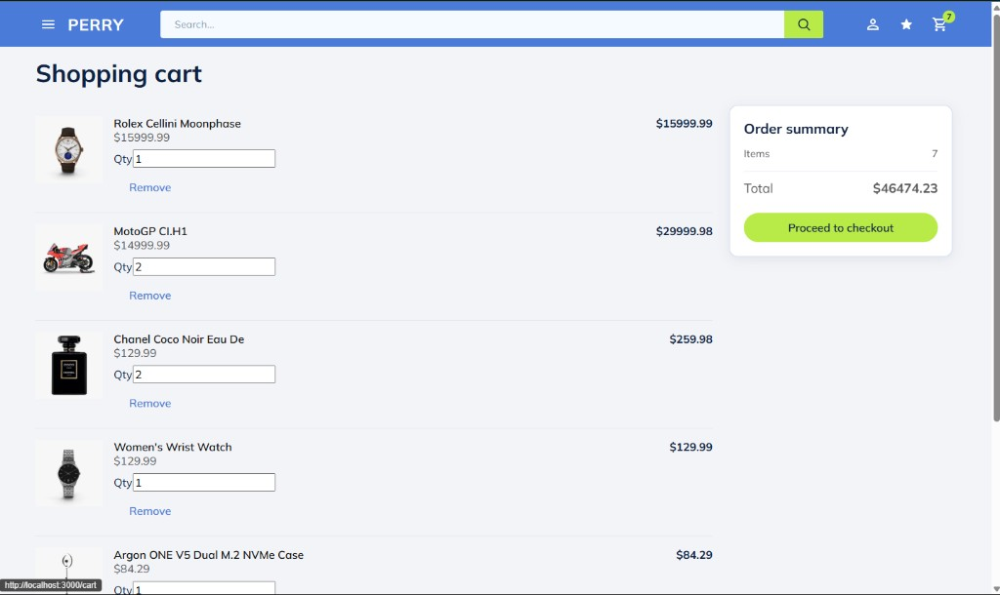

Позиции, Qty, Proceed to checkout.

#### 12 · Checkout — Country

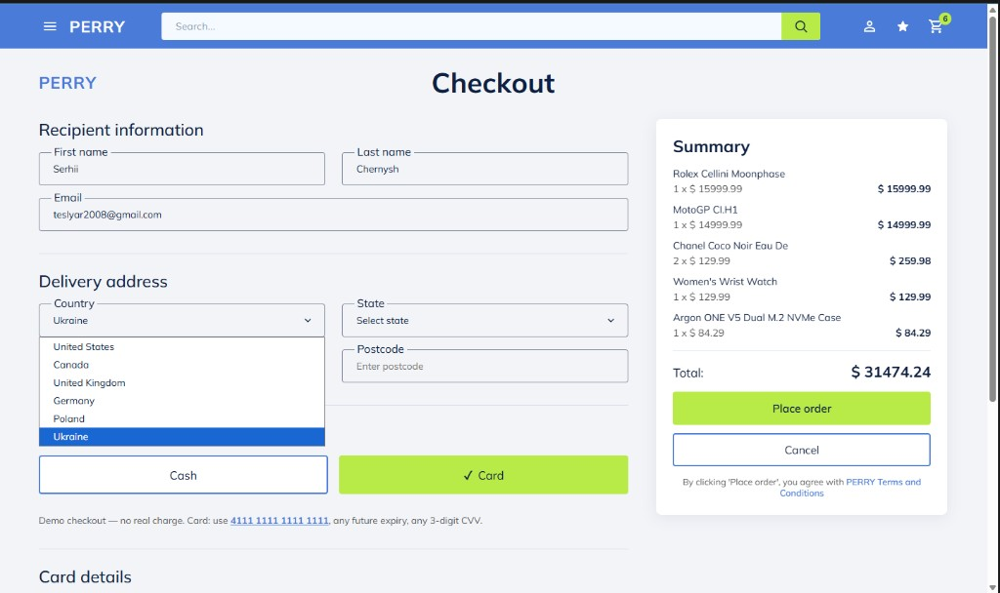

Ukraine, Card, Place order.

#### 13 · Checkout — State (области)

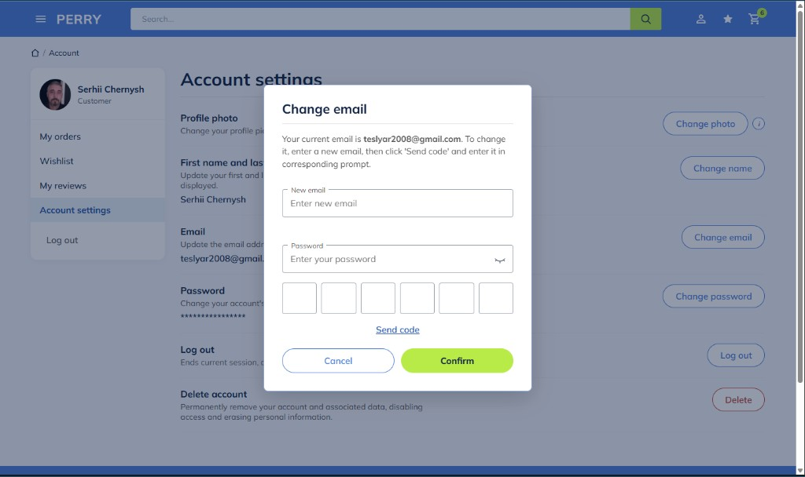

Выбор области Украины.

#### 14 · Checkout — City (Odesa)


Города Odesa Oblast.

### Личный кабинет

#### 15 · Wishlist

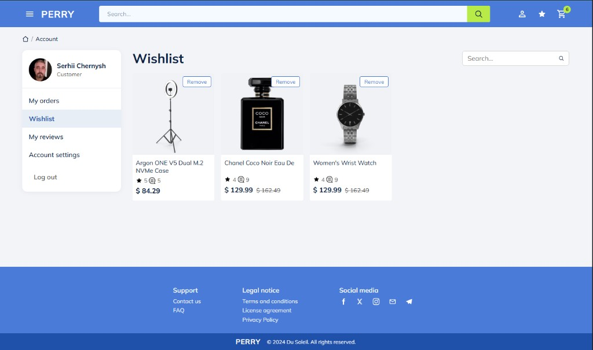

Избранное + аватар в сайдбаре.

#### 16 · My reviews

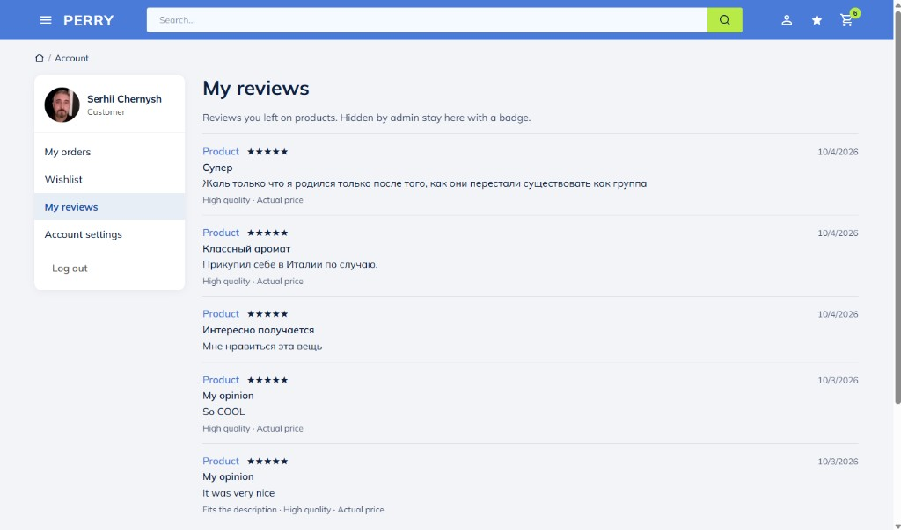

Отзывы пользователя.

#### 17 · Edit photo


Обрезка аватара.

#### 18 · Change name


Смена имени / фамилии.

### Legal

#### 19 · Terms


#### 20 · License


#### 21 · Privacy


### Админка

#### 22 · Products


Список + detail с галереей.

#### 23 · Categories


Дерево категорий + detail.

#### 24 · Edit subcategory


Модалка редактирования подкатегории.

#### 25 · Reviews

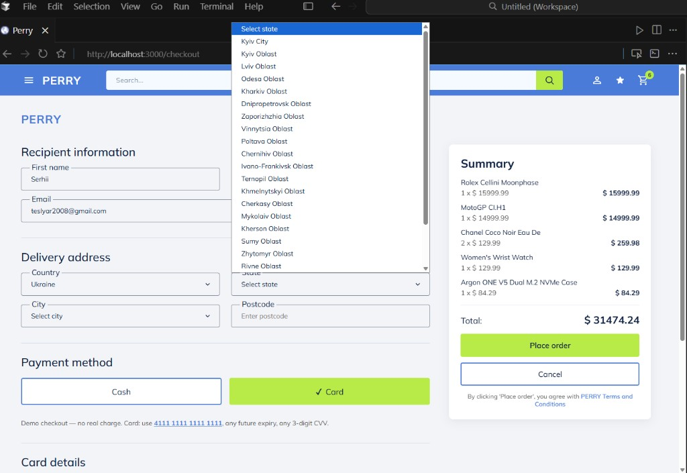

Модерация Approve / Delete.

#### 26 · Orders


Фильтры + statusCounts.

#### 27 · Users


Роли и статусы.

#### 28 · Users — Columns

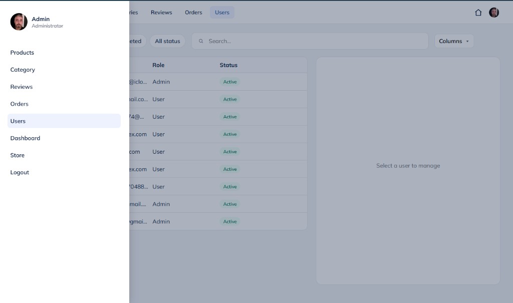

Колонки + аватар админа в шапке.

#### 29 · Users — empty

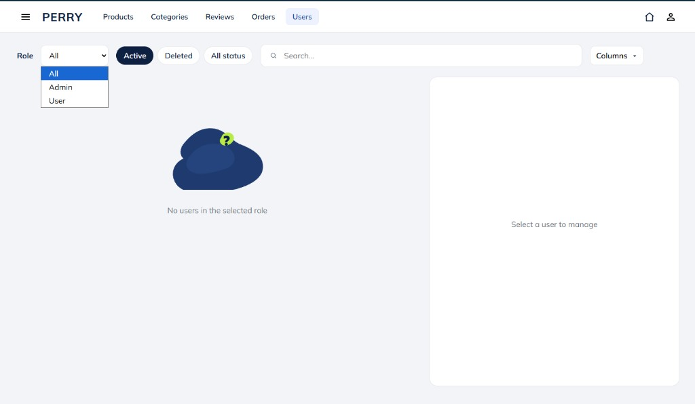

Empty state «No users in the selected role».

---

## Account — маршруты

| Маршрут | Экран |
|---------|--------|
| `/account/orders` | My orders + модалка Details |
| `/account/wishlist` | Wishlist + Remove confirm |
| `/account/reviews` | My reviews |
| `/account/settings` | Settings + модалки photo/name/password/email/logout/delete |

- Сайдбар: аватар, Customer/Admin, навигация Account
- Wishlist через API (`WishlistContext`)
- Смена email: пароль + 6-значный код

---
