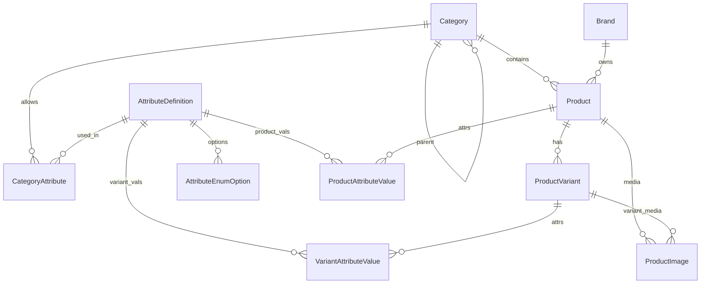

# Архитектура БД каталога товаров (дизайн)

Дизайн-документ для онлайн-супермаркета / маркетплейса **Perry** с большим разнообразием товаров и характеристик.

**Статус:** проектирование (код и миграции EF пока не меняем).  
**Цель:** ответить команде: как будут выглядеть таблицы под большой каталог и как данные поедут на фронт.

Связанные документы:
- текущие категории: [КАТЕГОРИИ.md](./КАТЕГОРИИ.md)
- общий обзор проекта: [ПРОДЕЛАННАЯ-РАБОТА.md](./ПРОДЕЛАННАЯ-РАБОТА.md)

---

## 1. Проблема текущей схемы Perry

Сейчас ([`Product`](../src/Perry.Domain/Entities/Product.cs) + [`ProductAttribute`](../src/Perry.Domain/Entities/ProductAttribute.cs)):

| Что есть | Ограничение для большого каталога |
|----------|-----------------------------------|
| Один `Product` = и карточка, и SKU | Нет вариантов (0.5л / 1л, S/M/L, цвет) без дублирования карточек |
| Цена и остаток на `Product` | Нельзя держать несколько фасовок с разной ценой/остатком |
| `ProductAttribute`: свободные `Name` + `Value` (строки) | Дубли «Color» / «Цвет» / «colour»; нет типов; слабые фильтры |
| Бренд — строка на товаре | Нет единого справочника брендов |
| Нет словаря характеристик по категории | Фронт не знает, какие фильтры показывать для «Молоко» vs «Телевизоры» |

Для супермаркета нужны: **варианты SKU**, **управляемые характеристики**, **фильтры по категории**.

---

## 2. Принципы целевой модели

1. **Product** — карточка «что продаём» (название, описание, категория, бренд, общие фото).  
2. **ProductVariant** — конкретный SKU: цена, остаток, штрихкод, фасовка.  
3. **Словарь атрибутов** (`AttributeDefinitions`) + привязка к категории — какие поля допустимы и фильтруемы.  
4. Значения атрибутов:
   - на **товаре** — общие (страна, материал корпуса);
   - на **варианте** — отличающие SKU (объём, размер, цвет).  
5. Фильтры каталога строятся **только** по атрибутам, объявленным для категории (`CategoryAttributes`).  
6. **Не** делаем отдельную SQL-таблицу на каждый тип товара (Milk / TShirt / Tv).



---

## 3. Таблицы и поля

### 3.1. `Brands`

Вынос бренда из строки на товаре.

| Поле | Тип | Назначение |
|------|-----|------------|
| `Id` | `Guid` | PK |
| `Name` | `string` | Отображаемое имя |
| `Slug` | `string` | Уникальный URL-код |
| `LogoUrl` | `string?` | Логотип |
| `IsActive` | `bool` | Видимость |

### 3.2. `Categories`

Без изменения идеи: дерево через `ParentCategoryId`.  
Подробно: [КАТЕГОРИИ.md](./КАТЕГОРИИ.md).

### 3.3. `Products` (карточка)

Цена и остаток **переезжают** на варианты. На карточке остаются общие поля.

| Поле | Тип | Назначение |
|------|-----|------------|
| `Id` | `Guid` | PK |
| `Name` | `string` | Название на витрине |
| `Description` | `string` | Описание |
| `Slug` | `string` | URL карточки (уникальный) |
| `CategoryId` | `Guid` | FK → Categories |
| `BrandId` | `Guid?` | FK → Brands |
| `Status` | enum | Draft / Active / Archived… |
| `AverageRating` | `decimal` | Кэш рейтинга |
| `ReviewCount` | `int` | Кэш числа отзывов |
| `IsBestSeller` | `bool` | Бейдж |
| `CreatedAtUtc` / `UpdatedAtUtc` | datetime | Служебные |

У карточки всегда есть **хотя бы один** вариант (часто `IsDefault = true`).

### 3.4. `ProductVariants` (SKU)

| Поле | Тип | Назначение |
|------|-----|------------|
| `Id` | `Guid` | PK |
| `ProductId` | `Guid` | FK → Products |
| `Sku` | `string` | Артикул (уникальный) |
| `Barcode` | `string?` | EAN/UPC |
| `Title` | `string?` | Подпись варианта («1 л», «Size M») |
| `Price` | `decimal` | Цена продажи |
| `OldPrice` | `decimal?` | Старая цена |
| `StockQuantity` | `int` | Остаток |
| `IsDefault` | `bool` | Вариант по умолчанию на карточке |
| `IsActive` | `bool` | Можно купить |
| `UnitOfMeasure` | `string?` | шт / л / кг / упак |
| `NetContent` | `decimal?` | Чистый объём/вес (для grocery) |
| `NetContentUnit` | `string?` | ml / g / l |

В корзину и заказ кладётся **VariantId**, не ProductId (или оба, но источник истины — variant).

### 3.5. `AttributeDefinitions` (словарь характеристик)

| Поле | Тип | Назначение |
|------|-----|------------|
| `Id` | `Guid` | PK |
| `Code` | `string` | Стабильный код: `color`, `volume_ml`, `size` |
| `Name` | `string` | Подпись для UI: «Цвет», «Объём» |
| `DataType` | enum | `String` / `Number` / `Bool` / `Enum` |
| `Unit` | `string?` | ml, g, inch… |
| `IsFilterable` | `bool` | Участвует в сайдбар-фильтрах |
| `IsVariantLevel` | `bool` | `true` → значение на варианте; `false` → на товаре |
| `SortOrder` | `int` | Порядок в таблице specs |

### 3.6. `CategoryAttributes`

Какие атрибуты доступны / обязательны в категории.

| Поле | Тип | Назначение |
|------|-----|------------|
| `Id` | `Guid` | PK |
| `CategoryId` | `Guid` | FK → Categories |
| `AttributeDefinitionId` | `Guid` | FK → AttributeDefinitions |
| `IsRequired` | `bool` | Обязателен при создании |
| `IsVisibleOnPdp` | `bool` | Показывать в specs |
| `SortOrder` | `int` | Порядок в фильтрах / форме |

Уникальность: пара `(CategoryId, AttributeDefinitionId)`.

Наследование по дереву категорий (на будущее): атрибуты родителя можно применять к детям в сервисе; в первой версии достаточно явной привязки к листьям/нужным узлам.

### 3.7. `AttributeEnumOptions`

Варианты для `DataType = Enum`.

| Поле | Тип | Назначение |
|------|-----|------------|
| `Id` | `Guid` | PK |
| `AttributeDefinitionId` | `Guid` | FK |
| `Code` | `string` | `m`, `l`, `black` |
| `Label` | `string` | «M», «L», «Чёрный» |
| `SortOrder` | `int` | Порядок в UI |

### 3.8. Значения: `ProductAttributeValues` и `VariantAttributeValues`

Вместо одной строки `Value` — типизированные колонки (в строке заполнена **одна** по `DataType`).

| Поле | Тип | Назначение |
|------|-----|------------|
| `Id` | `Guid` | PK |
| `ProductId` *или* `VariantId` | `Guid` | Владелец значения |
| `AttributeDefinitionId` | `Guid` | Какой атрибут |
| `ValueString` | `string?` | для String |
| `ValueNumber` | `decimal?` | для Number |
| `ValueBool` | `bool?` | для Bool |
| `EnumOptionId` | `Guid?` | для Enum → AttributeEnumOptions |

Уникальность: `(ProductId, AttributeDefinitionId)` / `(VariantId, AttributeDefinitionId)`.

### 3.9. Медиа: `ProductImages`

Как сейчас, плюс опционально:

| Поле | Тип | Назначение |
|------|-----|------------|
| `ProductId` | `Guid` | Карточка |
| `VariantId` | `Guid?` | Фото конкретного цвета/фасовки; `null` = общие |
| `Url` / `SortOrder` / `IsPrimary` | … | Как в текущей модели |

### 3.10. Что остаётся рядом (без переработки в этом дизайне)

Отзывы, корзина, заказы — как сейчас, с поправкой: позиция корзины/заказа ссылается на **`ProductVariantId`** (и снимок цены/названия).

---

## 4. Примеры «как выглядит в БД»

### 4.1. Молоко — фасовки 0.5 л и 1 л

**Product**

| Id | Name | Category | Brand |
|----|------|----------|-------|
| P1 | Молоко «Домашнее» 2.5% | Dairy / Milk | Prostokvashino |

**AttributeDefinitions (фрагмент)**

| Code | Name | DataType | IsVariantLevel | IsFilterable |
|------|------|----------|----------------|--------------|
| fat_percent | Жирность % | Number | false | true |
| volume_ml | Объём | Number | true | true |

**ProductAttributeValues**

| Product | Attr | ValueNumber |
|---------|------|-------------|
| P1 | fat_percent | 2.5 |

**ProductVariants**

| Id | Sku | Title | Price | Stock | NetContent | Unit |
|----|-----|-------|-------|-------|------------|------|
| V1 | MLK-05 | 0.5 л | 1.20 | 80 | 500 | ml |
| V2 | MLK-10 | 1 л | 2.10 | 120 | 1000 | ml |

**VariantAttributeValues**

| Variant | Attr | ValueNumber |
|---------|------|-------------|
| V1 | volume_ml | 500 |
| V2 | volume_ml | 1000 |

Покупатель выбирает фасовку → в корзину уходит `V1` или `V2`.

---

### 4.2. Футболка — размеры M / L

**Product:** «Classic Crew Tee», категория Tops.

**Атрибуты:** `color` (Enum, variant), `size` (Enum, variant), `material` (String, product).

**Enum options (size):** S, M, L, XL.

**Варианты**

| Sku | Title | Price | Stock |
|-----|-------|-------|-------|
| TEE-BLK-M | Black / M | 19.99 | 15 |
| TEE-BLK-L | Black / L | 19.99 | 8 |

Значения `color=Black`, `size=M|L` — в `VariantAttributeValues` через `EnumOptionId`.

---

### 4.3. Телевизор — диагональ / память как варианты

**Product:** «Smart TV Series X», категория TVs.

| Sku | Title | Price | Variant attrs |
|-----|-------|-------|---------------|
| TV-55-64 | 55" / 64 GB | 499 | screen_inch=55, storage_gb=64 |
| TV-65-128 | 65" / 128 GB | 699 | screen_inch=65, storage_gb=128 |

Общие для карточки (ProductAttributeValues): `os=Android TV`, `resolution=4K`.

---

## 5. Как это передаётся (эскиз API)

Без реализации кода — контракт для фронта (perry-front / любых клиентов).

### 5.1. Карточка товара

`GET /api/products/{id|slug}`

```json
{
  "id": "P1",
  "name": "Молоко «Домашнее» 2.5%",
  "slug": "moloko-domashnee-2-5",
  "description": "...",
  "brand": { "id": "...", "name": "Prostokvashino", "slug": "prostokvashino" },
  "category": { "id": "...", "name": "Milk", "slug": "milk" },
  "attributes": [
    { "code": "fat_percent", "name": "Жирность %", "value": 2.5, "unit": "%" }
  ],
  "images": [{ "url": "/uploads/milk.jpg", "isPrimary": true }],
  "variants": [
    {
      "id": "V1",
      "sku": "MLK-05",
      "title": "0.5 л",
      "price": 1.20,
      "oldPrice": null,
      "stockQuantity": 80,
      "isDefault": true,
      "attributes": [
        { "code": "volume_ml", "name": "Объём", "value": 500, "unit": "ml" }
      ]
    },
    {
      "id": "V2",
      "sku": "MLK-10",
      "title": "1 л",
      "price": 2.10,
      "stockQuantity": 120,
      "isDefault": false,
      "attributes": [
        { "code": "volume_ml", "name": "Объём", "value": 1000, "unit": "ml" }
      ]
    }
  ]
}
```

### 5.2. Схема фильтров категории

`GET /api/categories/{slug}/attributes`

```json
{
  "categorySlug": "milk",
  "filters": [
    {
      "code": "fat_percent",
      "name": "Жирность %",
      "dataType": "number",
      "unit": "%",
      "isVariantLevel": false
    },
    {
      "code": "volume_ml",
      "name": "Объём",
      "dataType": "number",
      "unit": "ml",
      "isVariantLevel": true
    },
    {
      "code": "brand",
      "name": "Бренд",
      "dataType": "enum",
      "options": [
        { "code": "prostokvashino", "label": "Prostokvashino" }
      ]
    }
  ]
}
```

Фронт рисует сайдбар только по этой схеме; значения для фильтров подтягивает из агрегатов `/api/products?...`.

### 5.3. Список каталога

`GET /api/products?categorySlug=milk&volume_ml=1000&page=1`

В краткой карточке списка достаточно: product id/name/image + **defaultVariant** (цена, остаток) + бейджи.

---

## 6. Что сознательно не делаем в этой версии дизайна

| Не делаем | Почему / когда позже |
|-----------|----------------------|
| Отдельная таблица на каждый тип товара | Взрыв схемы; атрибуты покрывают разнообразие |
| Полнотекстовый поиск Elasticsearch/OpenSearch | Следующий этап при росте каталога |
| Многоязычные Name атрибутов | Пока один язык UI |
| Рекурсивное наследование атрибутов по всему дереву категорий | Сначала явная привязка в `CategoryAttributes` |
| Миграции EF / правка кода Perry | Отдельный этап после утверждения документа |

---

## 7. Связь с текущей схемой Perry

| Сейчас | Целевая модель |
|--------|----------------|
| `Product` (цена, остаток, SKU) | `Product` + один `ProductVariant` (`IsDefault`) |
| `Product.Brand` (string) | `Brands` + `Product.BrandId` |
| `ProductAttribute` (Name/Value) | `AttributeDefinitions` + `ProductAttributeValues` / `VariantAttributeValues` |
| `Product.CategoryId` | без изменения смысла |
| `ProductImages` | + опциональный `VariantId` |
| Корзина: `ProductId` | `ProductVariantId` (+ снимок названия/цены) |

Миграция данных (позже): для каждого существующего `Product` создать default-variant, перенести Price/Stock/Sku; свободные атрибуты сопоставить по Name → Code или оставить как String до ручной нормализации.

---

## 8. Одной фразой для команды

> Каталог — это карточка **Product** + несколько **SKU (ProductVariant)**.  
> Разнородные характеристики не плодят таблицы: есть **словарь атрибутов** и значения на товаре/варианте.  
> Категория задаёт, **какие** атрибуты и фильтры доступны.  
> На фронт уходит JSON: карточка с `variants[]` и схема фильтров `GET .../attributes`.

---

## 9. Следующие шаги (после утверждения)

1. Согласовать названия enum `AttributeDataType` / статусов.  
2. План миграции EF + переход seed/админки.  
3. Расширить API products/categories под контракт §5.  
4. Обновить корзину/заказ на `VariantId`.

См. также: [КАТЕГОРИИ.md](./КАТЕГОРИИ.md), [КАК-ВЫПОЛНЯТЬ-ЗАДАНИЕ.md](./КАК-ВЫПОЛНЯТЬ-ЗАДАНИЕ.md).
