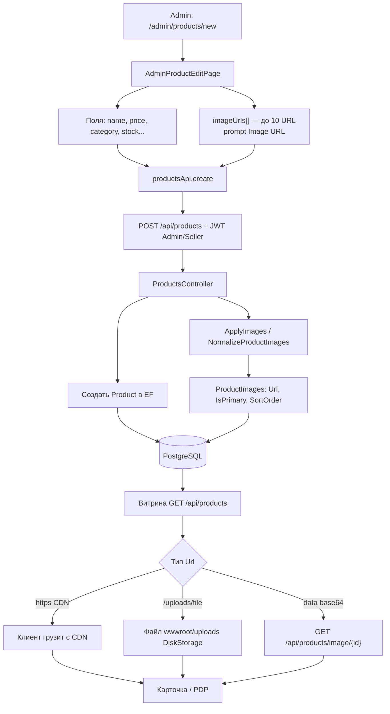

# Как добавляются новые товары и их изображения

**Суть:** админ не грузит multipart в текущей форме — передаёт URL. API сохраняет строки в `ProductImages`. Локальные файлы предусмотрены через `DiskStorageService` → `wwwroot/uploads` (относительный `/uploads/...`).
