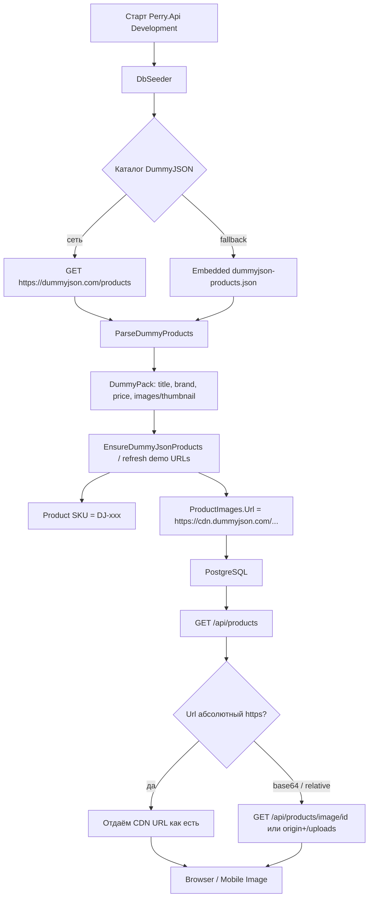

# Как витрина получила фото реального товара (DummyJSON)

**Суть:** не генерируем «заглушки» вручную — берём готовые товарные фото с CDN DummyJSON и кладём URL в `ProductImages`. Клиент грузит картинку напрямую с CDN.
