# Защита перед комиссией: [Product API](#product-api) (бэкенд без админки)

**Для кого:** ты (докладчик) — разобраться самому; комиссия — понять твою зону.  
**Роль:** весь **бэкенд витрины / покупателя** — [Product API](#product-api) ([`Perry.Api`](#perry-api)) + [PostgreSQL](#postgresql) + стык с [Auth](#auth).  
**Не зона отчёта:** админ-панель ([UI](#ui-ux) `/admin`, [Admin Service](#admin-service), DEV `Admin/Admin`).

**Слайды** встроены ниже как **Mermaid** (рендерятся в GitHub / VS Code Markdown Preview / Cursor). PNG-файлы остаются в папках `01_`…`14_` (для слайдов); в этом документе схемы только Mermaid, без дубля картинкой.

**Словарик:** клик по сокращению (например [JWT](#jwt)) — прыжок в конец этого же файла. Пути к коду (AuthClaims.cs) открывают исходники.

**Репо:** [Teslyar75/My_Amazon2](https://github.com/Teslyar75/My_Amazon2) · команда [Back_end_for_our_poroject](https://github.com/ITSTEP-PERRY/Back_end_for_our_poroject)  
**Демо:** [Swagger](#swagger) `http://localhost:5272/swagger` · `GET /api/health`

---

## Как пользоваться этим файлом

1. Читай блоки **«Зачем так»** и **«Что происходит по шагам»** — это шпаргалка «своими словами».  
2. Блоки **«Слайд N»** — показывай комиссии (preview или PNG).  
3. Перед защитой проговори вслух §16 (речь) и прогони §17 (демо).  
4. §10 — твои Done-карточки Trello: доказательство вклада.

---

## 0. Одной фразой

«Я отвечаю за **[Product API](#product-api)**: [REST](#rest) на [.NET 8](#dotnet) — каталог, корзина, заказы и отзывы покупателя. Пароли и аккаунты живут в **отдельном [Auth Service](#auth-service)**. Мы **валидируем** их [JWT](#jwt) и в своей [PostgreSQL](#postgresql) храним только торговые данные и [`UserId`](#userid) ([Guid](#guid)).»

---

## 1. Границы: что моё, что нет

| Моя зона (рассказываю подробно) | Не моя зона (одна фраза) |
|--------------------------------|---------------------------|
| Каталог, [facets](#facets), [PDP](#pdp), `/uploads` | Экраны React `/admin/*` |
| Корзина + [`sessionId`](#sessionid) + [merge](#merge) | [Admin Service](#admin-service) (список users) |
| Checkout, мои заказы, wishlist | DEV-логин `Admin`/`Admin` |
| Отзывы create / `/me`, StockNotify | Модерация отзывов в админке |
| [JWT](#jwt) validation, [`AuthClaims`](#authclaims), Internal [#97](#trello-97) | **Выдача** [JWT](#jwt) ([Auth Service](#auth-service)) |
| [EF](#ef), миграции, [DbSeeder](#dbseeder), Docker Compose | Razor `Perry.Web` как [UI](#ui-ux) |
| Health, [Swagger](#swagger), [CORS](#cors) витрины/Expo | Dashboard `#A14` и т.п. |

**Фраза комиссии:** «[Auth](#auth) пишет команда Влада (Backend-client). Я показываю Product как *[resource server](#resource-server)*: принимаем токен, читаем `sub`, пишем заказы.»

---

## Слайд 1 — Общая архитектура

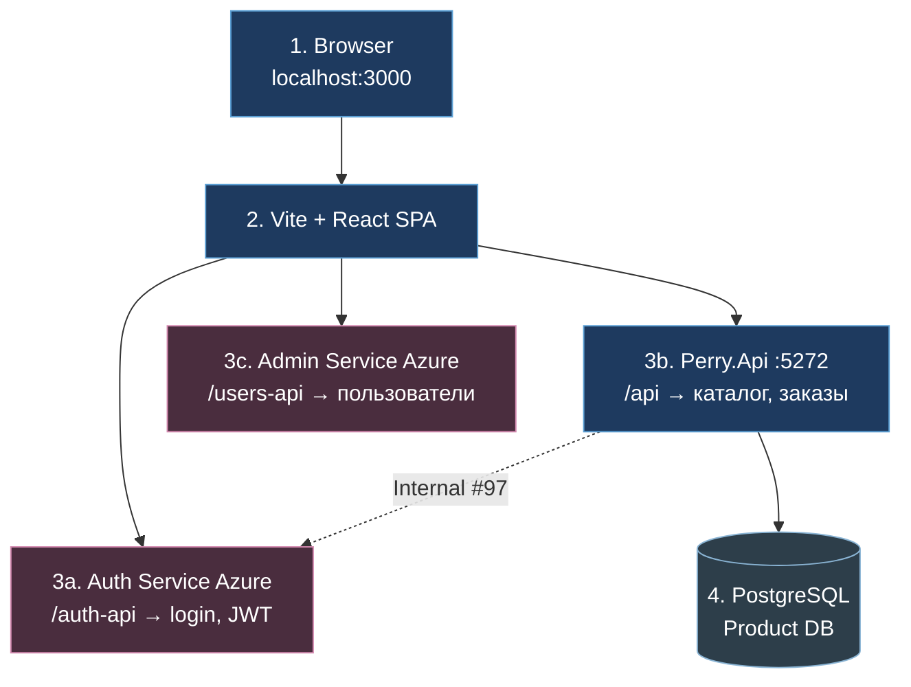

### Зачем так устроено

Интернет-магазин нельзя честно уместить в один сервис «и логин, и каталог, и админ-юзеры»:

- **[Auth](#auth)** отвечает за личность: регистрация, пароль, выпуск [JWT](#jwt).  
- **Product (я)** отвечает за торговлю: товары, цены, корзина, заказ.  
- **[Admin Service](#admin-service)** (не мой доклад) — [CRUD](#crud) пользователей для админки.

Если хранить Users и пароли в Product, придётся дублировать безопасность [Auth](#auth) и путаться с [FK](#fk). Команда выбрала разделение (**[#94](#trello-94)**): в Product **нет таблицы Users**.

### Что происходит, когда пользователь открывает сайт

1. Браузер грузит React с `:3000`.  
2. Каталог запрашивается как `/api/products` → [Vite](#vite) **проксирует** на мой Api `:5272`.  
3. Логин идёт на `/auth-api/...` → **не** на мой Api, а на Azure [Auth](#auth).  
4. После логина фронт кладёт [JWT](#jwt) в storage и дальше шлёт его мне в заголовке `Authorization: [Bearer](#bearer) …`.  
5. Я проверяю подпись токена тем же секретом, что у [Auth](#auth), и выполняю заказ/wishlist от имени [`UserId`](#userid) из [claims](#claims).

**Mobile:** часто ходит на `:5272` **напрямую** (без [Vite](#vite)). Контракт тот же: `/api/...` + [Bearer](#bearer).

---

## Слайд 2 — Куда уходит каждый URL (прокси)

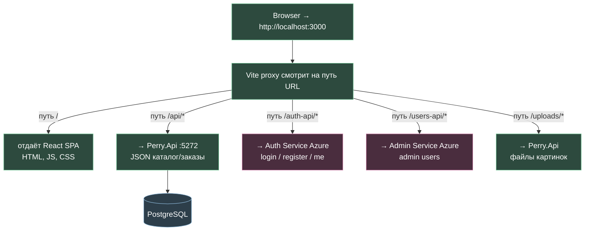

### Зачем proxy

Браузер запрещает «просто так» ходить с `localhost:3000` на чужой Azure-домен ([CORS](#cors)). В **dev** [Vite](#vite) делает вид, что всё same-origin:

| Путь на :3000 | Реальный сервер | Зачем тебе знать |
|---------------|-----------------|------------------|
| `/api/*` | **Perry.Api :5272** | Твой основной трафик |
| `/uploads/*` | **[`Perry.Api`](#perry-api)** | Картинки с диска [API](#api) |
| `/auth-api/*` | [Auth](#auth) Azure | Логин — не ты |
| `/users-api/*` | [Admin Service](#admin-service) | Админка Users — не ты |

На проде URL могут быть абсолютными через env (`VITE_*`), но **смысл тот же**: каталог всегда бьёт в Product.

**Ошибка новичка:** слать `POST /api/auth/login` на `:5272`. У Product **нет** login — будет 404. Login только на [Auth](#auth).

---

## Слайд 3 — Структура solution (слои кода)

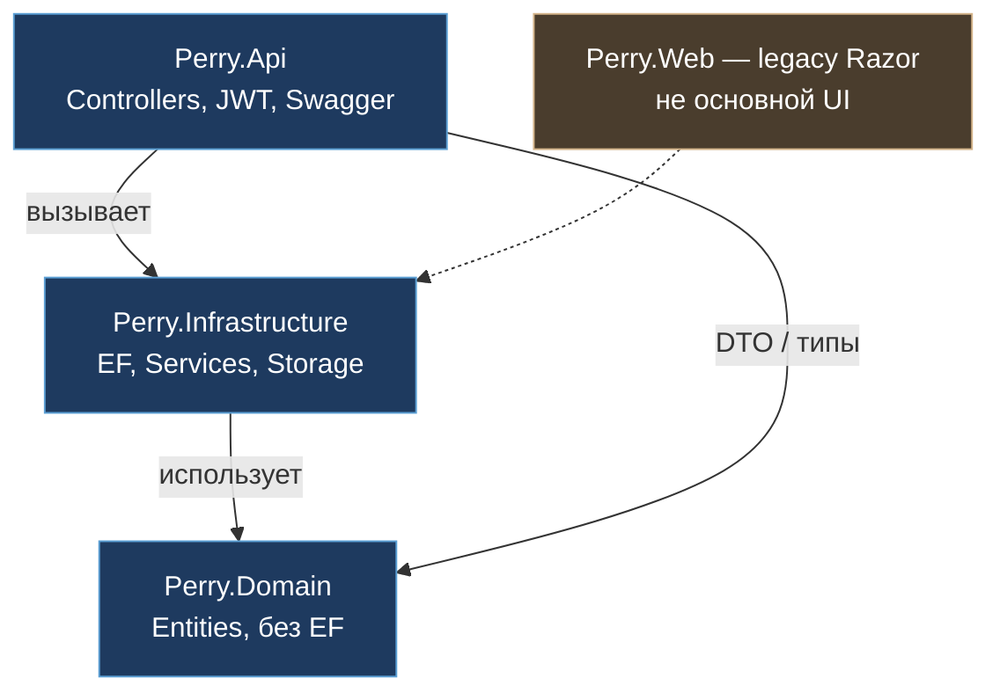

### Зачем слои (простыми словами)

| Проект | Аналогия | Что внутри |
|--------|----------|------------|
| **[`Perry.Api`](#perry-api)** | «Окно кассы» | [HTTP](#http): [Controllers](#controller) принимают [JSON](#json), отдают [JSON](#json). Здесь [JWT](#jwt), [CORS](#cors), [Swagger](#swagger), [`Program.cs`](#program-cs). |
| **[`Perry.Domain`](#perry-domain)** | «Словарь бизнеса» | Классы `Product`, `Order`, `Cart`… **без** ссылок на [EF](#ef). Чистые правила «что такое заказ». |
| **[`Perry.Infrastructure`](#perry-infra)** | «Склад и бухгалтерия» | [`AppDbContext`](#appdbcontext), Services (`CartService`, `OrderService`…), файлы uploads, клиент Internal [Auth](#auth). |
| **Perry.Web** | Старая витрина | Razor — для защиты **не обязателен**. |

**Правило:** контроллер **не** пишет [SQL](#sql) и не считает скидки сам. Он вызывает Service → Service через [EF](#ef) пишет в Postgres.

**Где смотреть в репо:**

- [`src/Perry.Api/Program.cs`](../src/Perry.Api/Program.cs) — сборка приложения, migrate, seeder  
- [`src/Perry.Api/Controllers/`](../src/Perry.Api/Controllers/) — маршруты ([Controllers](#controller))
- [`src/Perry.Api/Auth/AuthClaims.cs`](../src/Perry.Api/Auth/AuthClaims.cs) — как достаём [`UserId`](#userid) из [JWT](#jwt)  
- [`src/Perry.Infrastructure/Persistence/`](../src/Perry.Infrastructure/Persistence/) — DbContext, миграции  
- [`src/Perry.Infrastructure/Services/`](../src/Perry.Infrastructure/Services/) — бизнес-логика  

---

## Слайд 4 — Слой базы данных

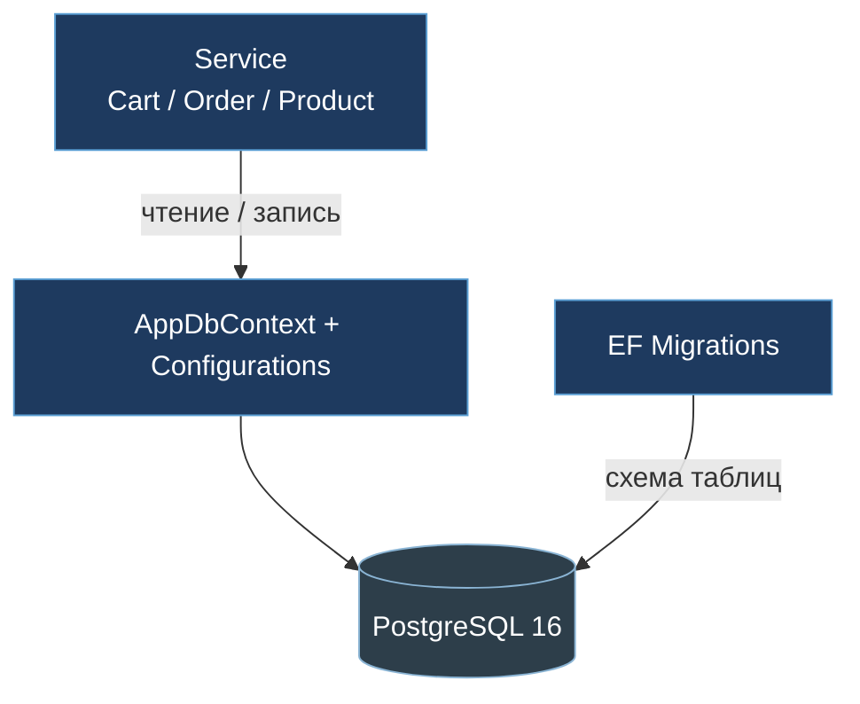

### Как это работает на практике

1. В [`.env`](#env) лежит `[ConnectionStrings__DefaultConnection](#env)` (Docker Postgres или Supabase).  
2. При старте Api [EF](#ef) делает **[`MigrateAsync`](#migrate-async)**: схема [БД](#db) догоняет код.  
3. **[`DbSeeder`](#dbseeder)** (Development) кладёт категории, товары, иногда заказы; фото могут браться из [DummyJSON](#dummyjson) — чтобы на демо не было серых квадратов.  
4. Сервисы получают [`AppDbContext`](#appdbcontext) через [DI](#di) (scoped на запрос).

### Почему нет Users ([#94](#trello-94)) — важнейший тезис

Раньше в Product были сущности пользователя. Их **убрали**:

- пароли и email «истины» — у [Auth](#auth);  
- в `Order`, `WishlistItem`, `ProductReview` остаётся поле **[`UserId`](#userid) (Guid)**;  
- значение берётся из [JWT](#jwt) (`sub`), а не из query `?userId=` (это закрыло дыру безопасности — **[#73](#trello-73)**).

**Аналогия:** в магазине на кассе не хранят паспортные столы граждан — хранят номер клиента и чеки. Паспорт выдал МВД ([Auth](#auth)).

### Главные таблицы «витринного» мира

| Область | Сущности | Зачем |
|---------|----------|--------|
| Каталог | Category (дерево), Product, Images, Attributes, About | Home, list, [PDP](#pdp) |
| Корзина | Cart, CartItem | гость + пользователь |
| Заказы | Order, OrderItem | [checkout](#checkout), «мои заказы» |
| Отзывы | ProductReview (+ tags…) | рейтинг и тексты |
| Прочее | WishlistItem, StockNotifyRequest | избранное, «сообщить о наличии» |

---

## Слайд 4b — Миграция на [PostgreSQL](#postgresql) ([#A08](#trello-a08))

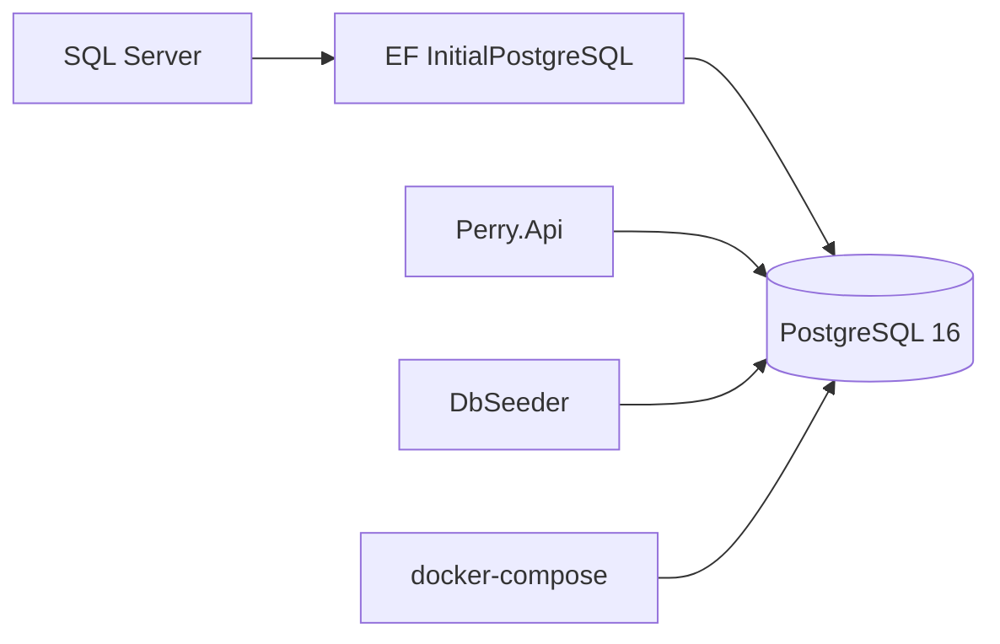

**Зачем рассказывать:** это видимый инженерный вклад. Ушли с [LocalDB](#localdb)/SQL Server на [PostgreSQL](#postgresql) 16 + [Npgsql](#npgsql), чтобы одинаково жить в Docker, [CI](#ci-cd) и (опционально) Supabase. На защите: «одна миграция `InitialPostgreSQL`, compose поднимает Postgres, Api мигрирует при старте».

---

## Слайд 5 — Маршруты [API](#api) (что показывать)

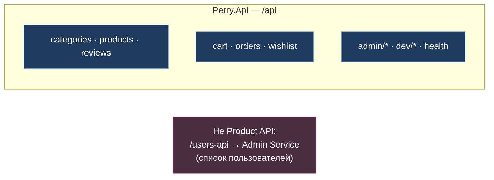

### Публичное (часто без токена)

| Метод | Путь | Смысл простыми словами |
|-------|------|------------------------|
| GET | `/api/health` | «Сервис и [БД](#db) живы?» |
| GET | `/api/categories` | Дерево категорий для меню/Home |
| GET | `/api/products?page&pageSize&sort&search&categoryId&…` | Витрина-список + [facets](#facets) |
| GET | `/api/products/{id}` | Карточка товара ([PDP](#pdp)): галерея, related, отзывы |

Гость **должен** видеть каталог без логина — иначе магазин мёртв.

### С токеном покупателя ([Bearer](#bearer))

| Метод | Путь | Смысл |
|-------|------|--------|
| * | `/api/cart…` | Корзина; query [`sessionId`](#sessionid) для гостя |
| POST | `/api/cart/merge` | После login склеить гостевую корзину с user |
| POST | `/api/orders/checkout` | Оформить заказ |
| GET | `/api/orders` | Мои заказы |
| * | `/api/wishlist…` | Избранное |
| POST | `/api/reviews` | Написать отзыв |
| GET | `/api/reviews/me` | Мои отзывы |
| POST | `/api/products/{id}/notify` | Notify when available |

### На слайде есть `admin/*` / `dev/*` — что сказать

«В том же Api есть admin-ветки и DEV-login — ими в этом докладе не занимаюсь; зона админки у другого отчёта. Я фокусируюсь на покупательских маршрутах и `/api/health`.»

[Swagger](#swagger) (`:5272/swagger`) — лучший живой слайд: открой `GET /products`, потом с Authorize — [checkout](#checkout).

---

## Слайд 6 — Путь одного [HTTP](#http)-запроса

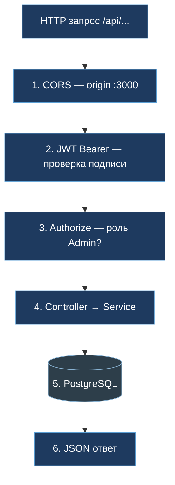

### Разбор для себя (чтобы не путаться на вопросах)

1. **[CORS](#cors)**  
   Браузер с `:3000` / Expo `:8081` имеет право вызвать Api. Без [CORS](#cors) preflight упадёт ещё до контроллера. Mobile native [CORS](#cors) не использует — там другой networking.

2. **Authentication ([JWT](#jwt))**  
   Если заголовок `Authorization` есть — middleware проверяет:
   - подпись **[HS256](#hs256)** секретом [`Jwt__SigningSecret`](#jwt-signing-secret) (тот же, что у [Auth](#auth));  
   - Issuer ≈ `Perry.AuthService`;  
   - Audience ≈ `Perry.Client`;  
   - срок `exp`.  
   Плохой токен → **401**.  
   Для публичного GET каталога токен **не обязателен**.

3. **Authorization**  
   Атрибут [`[Authorize]`](#authorize) на [checkout](#checkout)/wishlist/reviews create: «кто-то вошёл».  
   Политика Admin — для админ-операций (не акцент).

4. **[Controller](#controller)**  
   Парсит query/body, достаёт [`UserId`](#userid) через [`AuthClaims`](#authclaims).GetUserId(User), зовёт Service.

5. **Service + [EF](#ef)**  
   Бизнес-правила: хватает ли stock, уникален ли отзыв, как [merge](#merge) корзин.

6. **Ответ**  
   [JSON](#json) [DTO](#dto). Ошибки: 404 «не найдено», 400 валидация, тело часто с `error` / `message`.

**Типичный баг на демо:** секрет в [`.env`](#env) Product ≠ секрет [Auth](#auth) → все [Bearer](#bearer) 401. Лечится сверкой [`Jwt__SigningSecret`](#jwt-signing-secret).

---

## Слайд 7 — Три потока [Auth](#auth) (что моё)

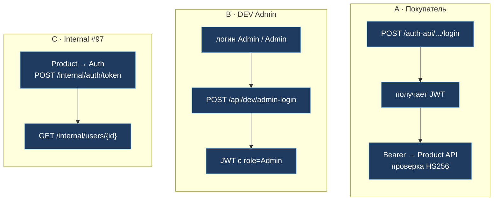

### Поток A — покупатель (разжёвано)

1. [UI](#ui-ux) показывает форму логина.  
2. Фронт **не** зовёт Product — зовёт [Auth](#auth): email/password.  
3. [Auth](#auth) отвечает access token ([JWT](#jwt)). Внутри [claims](#claims): кто пользователь (`sub`), иногда email, role.  
4. Фронт сохраняет токен.  
5. Любой запрос «от моего имени» к Product:  
   `Authorization: Bearer …` ([Bearer](#bearer) = схема заголовка)  
6. Product:
   - проверяет подпись общим секретом (**[#95](#trello-95)**);  
   - [`AuthClaims`](#authclaims).GetUserId читает `sub` (запасные имена [claims](#claims) — на случай разного формата токена);  
   - дальше в [SQL](#sql) пишется этот [Guid](#guid).

Код (идея):

```csharp
// AuthClaims.GetUserId — читаем sub / NameIdentifier / userId …
var userId = AuthClaims.GetUserId(User);
if (userId is null) return Unauthorized();
```

### Поток B — DEV Admin

Только Development: быстрый вход в админку без Azure. **На комиссии:** «есть для локальной отладки админки, в покупательском сценарии не использую».

### Поток C — Internal ([#97](#trello-97))

Иногда нужен **имя** покупателя в заказе, а Users-таблицы нет. Product как сервис:

1. `POST {Auth}/internal/auth/token` ([Auth](#auth)) с `serviceName` + credential (plaintext из [`.env`](#env), **не** hash).  
2. С service [JWT](#jwt): `GET /internal/users/{id}`.  
3. Подставляет display name в ответ/заказ.

Это **[server-to-server](#s2s)**, браузер сюда не ходит. Секреты не на слайды.

---

## Слайд 8 — Микросервисы [Auth](#auth) ↔ Product

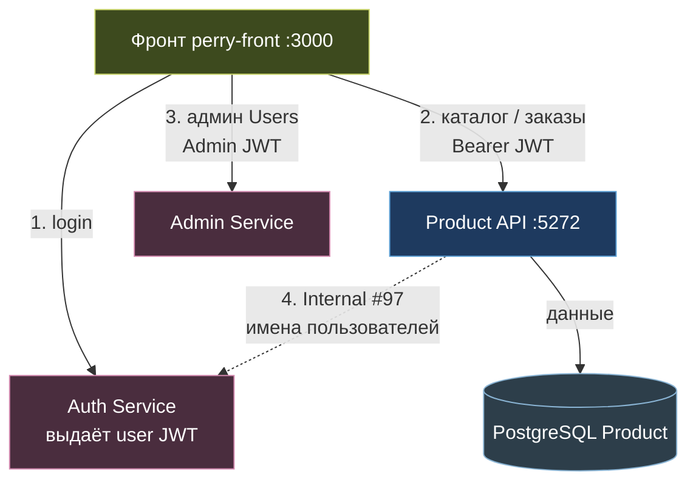

### Что запомнить назубок

| Вопрос комиссии | Короткий ответ |
|-----------------|----------------|
| Кто выдаёт [JWT](#jwt)? | [Auth Service](#auth-service) |
| Кто хранит товары и заказы? | Product + [PostgreSQL](#postgresql) (**я**) |
| Где Users? | В [Auth](#auth) / [Admin Service](#admin-service), **не** в Product DB |
| Как связаны сервисы? | Общий [HS256](#hs256) secret + (опц.) Internal [API](#api) |
| Что сделал я по стыку? | [#94](#trello-94) Users out · [#95](#trello-95) валидация [JWT](#jwt) · [AuthClaims](#authclaims) · Internal client |

Слайд 13 — хороший «центр» доклада: три стрелки от [FE](#fe), ты указываешь на синий Product.

---

## Слайд 9 — Корзина → заказ (главный сценарий)

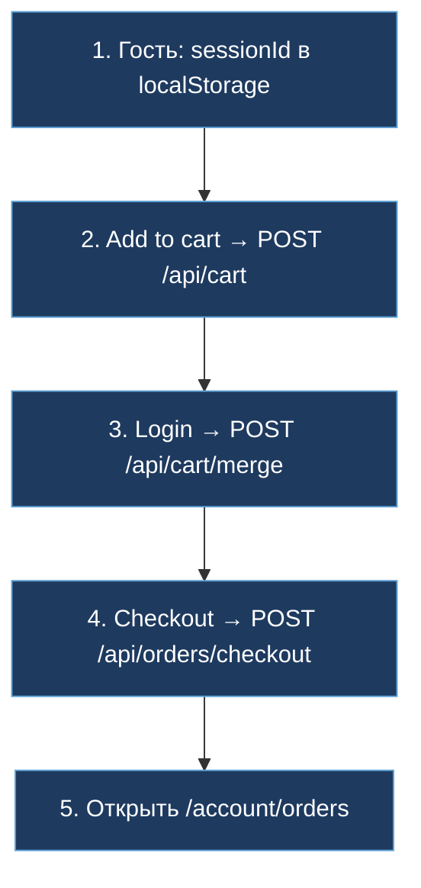

### Зачем [`sessionId`](#sessionid) (часто спрашивают)

Пока человек **не** вошёл, у нас нет [`UserId`](#userid). Но корзину терять нельзя:

1. Клиент генерирует [UUID](#uuid) один раз (`perry_cart_session` / аналог) и шлёт `?sessionId=` на cart [API](#api).  
2. В [БД](#db) строки корзины висят на этой сессии.  
3. После login вызывается **`POST /api/cart/merge`** с телом `{ sessionId }` и [Bearer](#bearer): сервер переносит позиции «на пользователя».  
4. Checkout читает корзину (уже user или ещё session — по реализации), создаёт `Order` + `OrderItem`, чистит корзину. В заказ пишутся `shippingAddress`, `paymentType`, `recipientName` (**[#A05](#trello-a05)**), номер заказа (**[#A12](#trello-a05)**), seller при необходимости (**[#A11](#trello-a05)**), метка обновления (**[#A10](#trello-a05)**).

**Без [merge](#merge):** гость набрал товары → залогинился → пустая корзина → злость на демо. Merge — обязательный рассказ.

### Что лежит в [checkout](#checkout) body (ориентир)

```json
{
  "sessionId": "…-uuid-…",
  "shippingAddress": "…",
  "paymentType": "Cash",
  "recipientName": "…"
}
```

Ответ — созданный заказ (id / orderNumber). Дальше [UI](#ui-ux) открывает «Мои заказы».

---

## Слайд 10 — Каталог глазами [API](#api)

Отдельной PNG нет — логика на слайде 5 + демо [Swagger](#swagger).

### Список товаров

Клиент: `GET /api/products?page=1&pageSize=20&sort=newest&categoryId=…&search=…&brands=…`

Сервер:

1. Фильтрует/сортирует в [EF](#ef).  
2. Считает пагинацию (`total`, `totalPages`).  
3. Часто отдаёт **`facets`** — какие бренды/цвета/размеры ещё доступны (для фильтров [UI](#ui-ux)).  
4. У каждого item: `id`, `name`, `brand`, `price`, `oldPrice`, `imageUrl`, рейтинг…

### Карточка товара ([PDP](#pdp))

`GET /api/products/{id}` — тяжёлый [JSON](#json): описание, stock, attributes, aboutItems, images[], reviews, related[], saleRelated[].

### Медиа

- Абсолютный `https://…` ([DummyJSON](#dummyjson) [CDN](#cdn) и т.п.) — отдаём как есть.  
- Относительный `/uploads/…` — файл с диска Api (`wwwroot/uploads`); клиент склеивает с origin `:5272`.  
- Base64 в `ProductImages.Url` — отдача через `GET /api/products/image/{id}`.

**Фраза:** «Каталог публичный; персональные действия — только с [JWT](#jwt).»

#### Как получили фото «реального» товара ([DummyJSON](#dummyjson))

При старте Api в Development [DbSeeder](#dbseeder) подтягивает каталог DummyJSON (сеть `dummyjson.com/products` или встроенный `dummyjson-products.json`), мапит категории Perry, создаёт товары `SKU = DJ-xxx` и пишет в `ProductImages` готовые URL вида `https://cdn.dummyjson.com/product-images/...`. Плейсхолдеры при refresh заменяются на CDN; уже заданные `/uploads/...` и cdn.dummyjson **не трогаем**.

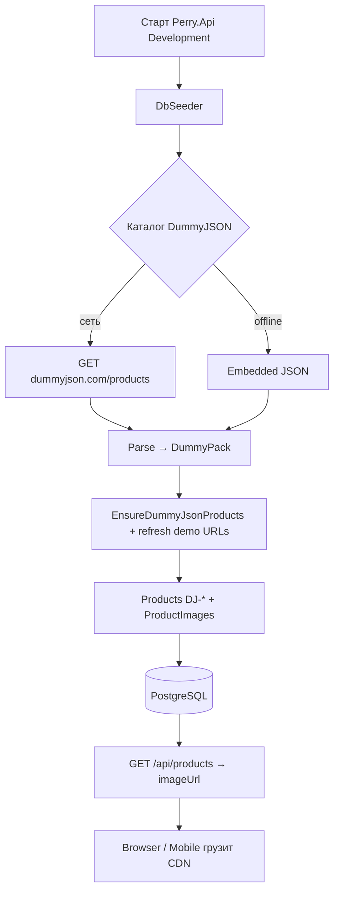

#### Как добавляют новый товар и изображения

Админ UI `AdminProductEditPage` (`/admin/products/new` или `/:id`) собирает форму и до 10 URL (`imageUrls`). Front: `POST/PUT /api/products` с [JWT](#jwt) ролей `Admin`/`Seller`. Api создаёт/обновляет `Product` и через `ApplyImages` пишет `ProductImages` (primary, sortOrder). Витрина читает те же URL.

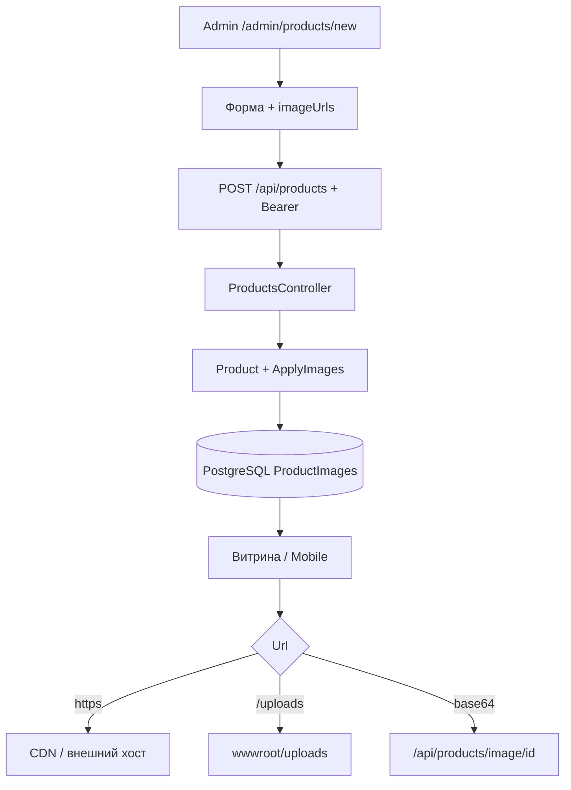

---

## Слайд 11 — Вклад по Trello Done (бэкенд)

Ниже — **твои** закрытые карточки (участник Сергей Черныш, колонка Done, срез 2026-10-03). На защите не зачитывай всё: пройди **группы** и назови 2–3 номера из каждой.

### 11.1. Фундамент

| # | Суть | Ссылка |
|---|------|--------|
| **#1** | Solution Api / Domain / Infrastructure | [карточка](https://trello.com/c/zvHHwEVX) |
| **#2** | [EF](#ef) модель и миграции | [карточка](https://trello.com/c/cUK22DDD) |
| **#3** | [DbSeeder](#dbseeder) каталога | [карточка](https://trello.com/c/gw6UruV1) |
| **#5** | Docker Compose + env | [карточка](https://trello.com/c/0bJvprYW) |
| **[#A08](#trello-a08)** | SQL Server → [PostgreSQL](#postgresql) | [карточка](https://trello.com/c/ORMRprbu) |
| **#A02** | Merge веток / миграции | [карточка](https://trello.com/c/BgOTO4i6) |
| **#A06** | `/api/health` | [карточка](https://trello.com/c/GuHXZqMd) |

**Смысл для слушателя:** «С нуля подняли слои .NET, модель данных, сидер, Docker и переехали на Postgres.»

### 11.2. Каталог, корзина, заказы

| # | Суть | Ссылка |
|---|------|--------|
| **#71** | [REST](#rest) categories/products | [карточка](https://trello.com/c/ldmk2ZKn) |
| **#72** | [REST](#rest) cart + [checkout](#checkout) | [карточка](https://trello.com/c/zQTnIfxL) |
| **[#73](#trello-73)** | [JWT](#jwt) вместо query userId | [карточка](https://trello.com/c/ug9ctcO9) |
| **#76** | [Swagger](#swagger) контракты | [карточка](https://trello.com/c/QCQIOeSA) |
| **#A03** | Seed заказов | [карточка](https://trello.com/c/wBwWx2mO) |
| **[#A05](#trello-a05)** | shipping / paymentType | [карточка](https://trello.com/c/GcxLPwgF) |
| **[#A10](#trello-a05)** | last update заказа | [карточка](https://trello.com/c/ZBJZpgnW) |
| **[#A11](#trello-a05)** | Seller | [карточка](https://trello.com/c/BvEAQHah) |
| **[#A12](#trello-a05)** | orderNumber | [карточка](https://trello.com/c/cMuMpoyL) |
| **[#A13](#trello-a05)** | notify при смене статуса | [карточка](https://trello.com/c/rDDR1nee) |
| **#90** | Statistics [API](#api) | [карточка](https://trello.com/c/Q6RN6fbS) |
| **#91** | Wishlist | [карточка](https://trello.com/c/Z7Gti7mz) |
| **#30** | Notify when available ([BE](#be)) | [карточка](https://trello.com/c/vGukVFQZ) |

**Смысл:** «Полный покупательский контур магазина на [API](#api).»

### 11.3. Отзывы

| # | Суть | Ссылка |
|---|------|--------|
| **#34** | Reviews UX+[API](#api) база | [карточка](https://trello.com/c/mZEblhPK) |
| **#99** | Контракт POST /reviews | [карточка](https://trello.com/c/OlAEuFoq) |
| **#100** | [AuthClaims](#authclaims) + Authorize | [карточка](https://trello.com/c/z9oM60XK) |
| **#101** | Unique + пересчёт рейтинга | [карточка](https://trello.com/c/lTtOFXBU) |
| **#102** | GET /reviews/me | [карточка](https://trello.com/c/W311ZwvW) |
| **#104** | Теги | [карточка](https://trello.com/c/79O9FVO7) |

**Смысл:** «Отзыв нельзя подделать чужим userId; один отзыв на товар; рейтинг товара пересчитывается.»

### 11.4. Стык [Auth](#auth) + почта

| # | Суть | Ссылка |
|---|------|--------|
| **[#94](#trello-94)** | Remove Users из Product | [карточка](https://trello.com/c/NCWUFlqw) |
| **[#95](#trello-95)** | [JWT](#jwt) secret / [claims](#claims) / Internal | [карточка](https://trello.com/c/T28F0b7e) |
| **#15** | [Auth](#auth)-токены в [БД](#db) | [карточка](https://trello.com/c/bkQFgXb0) |
| **#14** | Реальный [SMTP](#smtp) | [карточка](https://trello.com/c/cUMg88Hg) |

### 11.5. Документация [API](#api) для мобилки

| # | Суть | Ссылка |
|---|------|--------|
| **[MB01](#mb01)** | Как подключить Login/Main/List/PDP к бэку | [карточка](https://trello.com/c/aSQ3QDvN) |

### 11.6. Готовая фраза (40 сек)

«В Done по бэкенду: фундамент #1–#3 и [PostgreSQL](#postgresql) [#A08](#trello-a08); [REST](#rest) каталога и cart/checkout #71–[#73](#trello-73); заказы [#A05](#trello-a05), [#A10](#trello-a05)–[#A13](#trello-a05); wishlist #91 и notify #30; пакет отзывов #99–#104; вынос Users [#94](#trello-94) и [JWT](#jwt)-стык [#95](#trello-95). Админ-[UI](#ui-ux) в доклад не входит.»

### 11.7. Done у меня, но не акцент этого отчёта

Admin Orders **#93 / #A09**, admin-only **#A04 / #A07**, чистый [FE](#fe) **#29 / #40 / #103**, mobile [UI](#ui-ux), слайды PPTX — при вопросе: «делал(а), но зона админки/фронта, сейчас фокус [Product API](#product-api) покупателя».

---

## 12. Стек (шпаргалка)

| Слой | Технология |
|------|------------|
| Runtime | [.NET 8](#dotnet), [ASP.NET Core](#aspnet-core) Web [API](#api) |
| [ORM](#orm) | [EF Core](#ef) 8 + [Npgsql](#npgsql) |
| [БД](#db) | [PostgreSQL](#postgresql) 16 (Docker / Supabase) |
| [Auth](#auth) | [JWT](#jwt) [HS256](#hs256), shared secret с [Auth Service](#auth-service) |
| Docs [API](#api) | [Swagger](#swagger) |
| Packaging | Docker Compose, GitHub Actions (build/test/gitleaks) |

Готовность Product (срез 02.10): **~85–90%** витринного контура.

---

## 13. Речь ~5–7 минут (привязка к слайдам)

| Время | Что говоришь | Слайд |
|-------|--------------|-------|
| 0:00–0:30 | Роль: [Product API](#product-api), не [Auth](#auth), не админка | — |
| 0:30–1:30 | Три сервиса; я — каталог/заказы + Postgres | **1**, **8** |
| 1:30–2:20 | [Proxy](#proxy): `/api` ко мне, `/auth-api` к [Auth](#auth) | **2** |
| 2:20–3:20 | Слои Api/Domain/Infrastructure; нет Users | **3**, **4** |
| 3:20–4:20 | Pipeline [CORS](#cors)→[JWT](#jwt)→Service; как читаем `sub` | **6**, **7** |
| 4:20–5:40 | sessionId → [merge](#merge) → [checkout](#checkout) → мои заказы + демо | **9** + [Swagger](#swagger) |
| 5:40–6:30 | Вклад Trello Done (группы) | **11** + **4b** |
| 6:30–7:00 | Вопросы; админку не раскрываю | — |

---

## 14. Демо-чеклист

```powershell
cd D:\Perry\My_Amazon2
# .env: ConnectionStrings + Jwt__SigningSecret
$env:ASPNETCORE_ENVIRONMENT='Development'
dotnet run --project src/Perry.Api --urls http://localhost:5272
```

| # | Действие | Успех |
|---|----------|--------|
| 1 | `GET /api/health` | 200 |
| 2 | `GET /api/products?page=1&pageSize=3` | items + картинки |
| 3 | `GET /api/categories` | дерево |
| 4 | `GET /api/products/{id}` | [PDP](#pdp) |
| 5 | Login на [Auth](#auth) → [Bearer](#bearer) | токен |
| 6 | cart add → [merge](#merge) → [checkout](#checkout) | order id |
| 7 | `GET /api/orders` | список |
| 8 | [Swagger](#swagger) Authorize | повторить 6–7 из [UI](#ui-ux) |

---

## 15. Вопросы комиссии — развёрнутые ответы

**«Зачем три бэкенда?»**  
Разделение ответственности: личность ([Auth](#auth)), торговля (Product), админ-юзеры ([Admin Service](#admin-service)). Product не дублирует пароли.

**«Как узнаёте пользователя без таблицы Users?»**  
В [JWT](#jwt) claim `sub` — [Guid](#guid). [`AuthClaims`](#authclaims).GetUserId. Пишем его в Order/Wishlist/Review.

**«Что будет, если подделать userId в query?»**  
Раньше так делали — закрыли **[#73](#trello-73)**. Сейчас userId из токена; чужой query игнорируется / не принимается.

**«Как связан секрет?»**  
Один [HS256](#hs256) [`Jwt__SigningSecret`](#jwt-signing-secret) у [Auth](#auth) и Product. Issuer/Audience согласованы. Секрет только в env.

**«Что такое sessionId?»**  
Id гостевой корзины. После login — [merge](#merge) в user-корзину, иначе потеряем товары.

**«Где бизнес-логика?»**  
Не в контроллере — в Infrastructure Services + Domain. Контроллер — [HTTP](#http)-адаптер.

**«Почему [PostgreSQL](#postgresql)?»**  
Командный стандарт, Docker, облако; миграция [#A08](#trello-a08) с SQL Server.

**«Internal [Auth](#auth)?»**  
Product как сервис получает service-token и читает профиль пользователя у [Auth](#auth), не копируя Users к себе.

**«Админка?»**  
Отдельный доклад. В Api есть admin-эндпоинты, [UI](#ui-ux) и [Admin Service](#admin-service) — не моя презентация сегодня.

**«Mobile?»**  
Тот же `/api` и [JWT](#jwt); URL `localhost` / `10.0.2.2` / [LAN](#lan); инструкция [MB01](#mb01).

---

## 16. Чего не обещать

- «Я написал весь [Auth](#auth)» — нет, стык и валидация.  
- «Админка полностью моя» — вне скоупа.  
- «Все карточки [Auth](#auth) #96–#108 закрыты» — часть ещё у [Auth](#auth); демо при этом работает.  
- Секреты [`.env`](#env) на слайдах.

---

## 17. Файлы рядом (если нужен большой экран)

| Слайд | PNG |
|-------|-----|
| 1 Архитектура | `01_architecture-overview/diagram.png` |
| 2 [Proxy](#proxy) | `02_architecture-request-flow/diagram.png` |
| 3 Solution | `03_backend-structure/diagram.png` |
| 4 [БД](#db) | `04_backend-database-layer/diagram.png` |
| 4b PG | `14_changelog-illustrations/pg-migration-flow.png` |
| 5 Routes | `05_backend-routes/diagram.png` |
| 6 Request | `06_backend-request-flow/diagram.png` |
| 7 [Auth](#auth) flows | `07_backend-auth-flow/diagram.png` |
| 8 Microservices | `13_auth-microservices/diagram.png` |
| 9 Cart→Order | `12_frontend-cart-[checkout](#checkout)-flow/diagram.png` |
| Все копии | `views_project/01-diagram.png` … |

Пересборка PNG: см. `project_defense/README.md` (`mmdc`).

---

*Документ: защита ITSTEP Perry · [Product API](#product-api) без админки. Источники: `project_defense` диаграммы, [Controllers](#controller)/[AuthClaims](#authclaims), Trello Done, `[docs/стыки/AUTH-INTEGRATION.md](../docs/стыки/AUTH-INTEGRATION.md)`.*

---

<a id="glossary"></a>

## Glossary

Полная копия также: [GLOSSARY-BACKEND.md](./GLOSSARY-BACKEND.md) · [СЛОВАРИК-БЭКЕНД.md](./СЛОВАРИК-БЭКЕНД.md)

## Термины

<a id="api"></a>

### API

**Application Programming Interface.** «Дверь» сервиса: набор URL, по которым клиент получает/отправляет данные (у нас REST JSON).

<a id="aspnet-core"></a>

### ASP.NET Core

**платформа Microsoft.** Для веб-API и сайтов; на ней стоит Perry.Api.

<a id="auth"></a>

### Auth

**Authentication / Authorization (сервис).** Отдельный Auth Service: логин, регистрация, выдача JWT. Не путать с Product API.

<a id="bearer"></a>

### Bearer

**Bearer token (схема HTTP).** Способ передать JWT: заголовок `Authorization: Bearer <токен>`.

<a id="be"></a>

### BE

**Backend.** Серверная часть (Api, БД). Метка на Trello.

<a id="cdn"></a>

### CDN

**Content Delivery Network.** Сеть раздачи файлов; картинки DummyJSON часто на CDN.

<a id="ci-cd"></a>

### CI / CD

**Continuous Integration / Delivery.** Автосборки в GitHub Actions (build, test, gitleaks…).

<a id="cli"></a>

### CLI

**Command Line Interface.** Работа из терминала (`dotnet`, `npm`).

<a id="cors"></a>

### CORS

**Cross-Origin Resource Sharing.** Можно ли сайту с `:3000` звать API на `:5272`. Настраивается в Api.

<a id="crud"></a>

### CRUD

**Create, Read, Update, Delete.** Базовые операции над данными.

<a id="css"></a>

### CSS

**Cascading Style Sheets.** Стили фронта; бэкендеру почти не нужен.

<a id="controller"></a>

### Controller

**ASP.NET контроллер.** Класс в Api: принимает HTTP и зовёт Service.

<a id="db"></a>

### DB / БД

**Database.** База данных; у Product — PostgreSQL.

<a id="di"></a>

### DI

**Dependency Injection.** Подсистема .NET: «подставь сервис в конструктор» (`AddScoped`…).

<a id="dns"></a>

### DNS

**Domain Name System.** Имена хостов → IP.

<a id="dto"></a>

### DTO

**Data Transfer Object.** Объект «для провода» (JSON), не обязательно = таблица БД.

<a id="ef"></a>

### EF / EF Core

**Entity Framework Core.** ORM: C#-запросы → SQL к Postgres.

<a id="env"></a>

### Env / .env

**Environment variables.** Секреты и строки подключения вне git (`ConnectionStrings__…`, `Jwt__…`).

<a id="fe"></a>

### FE

**Frontend.** Клиент (React, мобилка). Метка Trello.

<a id="fk"></a>

### FK

**Foreign Key.** Внешний ключ в БД. После #94 FK на Users в Product нет.

<a id="guid"></a>

### GUID / Uuid

**Globally Unique Identifier.** Уникальный id. У нас UserId, sessionId, id сущностей.

<a id="http"></a>

### HTTP / HTTPS

**HyperText Transfer Protocol (Secure).** Протокол запросов. HTTPS — с шифрованием (Auth на Azure).

<a id="hs256"></a>

### HS256

**HMAC SHA-256.** Алгоритм подписи JWT общим секретом (Auth + Product).

<a id="html"></a>

### HTML

**HyperText Markup Language.** Разметка страниц; отдаёт фронт.

<a id="paas"></a>

### IaaS / PaaS

**Infrastructure / Platform as a Service.** Типы облака; Azure Container Apps у Auth — скорее PaaS.

<a id="ide"></a>

### IDE

**Integrated Development Environment.** Cursor / VS / Rider.

<a id="idp"></a>

### IdP

**Identity Provider.** Кто выдаёт личность; у нас — Auth Service.

<a id="iss-aud"></a>

### iss / aud

**Issuer / Audience (JWT claims).** Кто выпустил токен и для кого. ≈ Perry.AuthService / Perry.Client.

<a id="json"></a>

### JSON

**JavaScript Object Notation.** Формат тел API: `{ "price": 10 }`.

<a id="jwt"></a>

### JWT

**JSON Web Token.** Подписанный «пропуск» после логина. Product проверяет, Auth выдаёт.

<a id="lan"></a>

### LAN

**Local Area Network.** Локальная сеть; телефон → `http://192.168.x.x:5272`.

<a id="localdb"></a>

### LocalDB

**SQL Server LocalDB.** Старый локальный SQL; заменён Postgres (#A08).

<a id="mvp"></a>

### MVP

**Minimum Viable Product.** Минимально рабочий набор фич для демо.

<a id="npgsql"></a>

### Npgsql

**.NET PostgreSQL driver.** Драйвер EF/ADO для PostgreSQL.

<a id="orm"></a>

### ORM

**Object-Relational Mapper.** Мост «классы C# ↔ таблицы SQL» (EF Core).

<a id="os"></a>

### OS

**Operating System.** Windows / Linux / Android / iOS.

<a id="pdp"></a>

### PDP

**Product Detail Page.** Страница товара. API: `GET /api/products/{id}`.

<a id="pk"></a>

### PK

**Primary Key.** Первичный ключ таблицы (`Id`).

<a id="png-svg"></a>

### PNG / SVG

**форматы картинок.** Слайды в project_defense — PNG; схемы ещё Mermaid/SVG.

<a id="pr"></a>

### PR

**Pull Request.** Предложение слить ветку в GitHub.

<a id="prod"></a>

### Prod / Production

**рабочая среда.** «Боевой» сервер, не Development.

<a id="proxy"></a>

### Proxy

**прокси.** В dev Vite пересылает `/api` → `:5272`, чтобы обойти CORS.

<a id="qa"></a>

### QA

**Quality Assurance.** Тесты / вопросы на защите (DEFENSE_QA).

<a id="rest"></a>

### REST

**Representational State Transfer.** Стиль API: ресурсы + GET/POST/PUT/DELETE.

<a id="repo"></a>

### Repo

**Repository.** 1) репозиторий GitHub; 2) паттерн доступа к данным.

<a id="rpc"></a>

### RPC

**Remote Procedure Call.** Другой стиль API; мы в основном REST.

<a id="saas"></a>

### SaaS

**Software as a Service.** Готовый сервис в облаке.

<a id="sdk"></a>

### SDK

**Software Development Kit.** Набор библиотек под платформу.

<a id="sha"></a>

### SHA

**Secure Hash Algorithm.** Семейство хешей; в HS256 — HMAC-SHA-256.

<a id="sla"></a>

### SLA

**Service Level Agreement.** Договорённость о доступности.

<a id="smtp"></a>

### SMTP

**Simple Mail Transfer Protocol.** Отправка почты (коды, notify) — #14.

<a id="spa"></a>

### SPA

**Single Page Application.** Один HTML + React (витрина `:3000`).

<a id="sql"></a>

### SQL

**Structured Query Language.** Язык запросов к БД; EF пишет SQL за нас.

<a id="ssh"></a>

### SSH

**Secure Shell.** Удалённый терминал.

<a id="tls"></a>

### SSL / TLS

**шифрование транспорта.** Шифрование HTTPS.

<a id="sso"></a>

### SSO

**Single Sign-On.** Один вход на много сервисов; у нас близко по духу JWT.

<a id="swagger"></a>

### Swagger / OpenAPI

**документация API.** Страница `:5272/swagger`.

<a id="ui-ux"></a>

### UI / UX

**User Interface / Experience.** Экран и удобство; зона FE.

<a id="url"></a>

### URI / URL

**адрес ресурса.** `http://localhost:5272/api/products`.

<a id="uuid"></a>

### UUID

**Universally Unique Identifier.** То же семейство, что GUID; sessionId корзины.

<a id="vm"></a>

### VM

**Virtual Machine.** Виртуальная машина.

<a id="vite"></a>

### Vite

**сборщик / dev-server.** Dev-сервер фронта `:3000` + proxy.

<a id="www"></a>

### WWW

**World Wide Web.** «Веб» в быту.

<a id="xml"></a>

### XML

**eXtensible Markup Language.** Старый формат; у нас почти везде JSON.

<a id="yaml"></a>

### YAML

**YAML Ain't Markup Language.** Часто конфиги CI (`*.yml`).

<a id="dotnet"></a>

### .NET 8

**платформа Microsoft.** Runtime нашего Api.

<a id="nuget"></a>

### NuGet

**пакетный менеджер .NET.** Как npm, но для C#.

<a id="product-api"></a>

### Product API

**Perry Product backend.** Бэкенд каталога и заказов на порту **:5272**.

<a id="perry-api"></a>

### Perry.Api

**проект Web API.** Controllers, JWT, Swagger, Program.cs.

<a id="perry-domain"></a>

### Perry.Domain

**слой Domain.** Сущности без EF.

<a id="perry-infra"></a>

### Perry.Infrastructure

**слой Infrastructure.** EF, Services, Storage, AuthInternalClient.

<a id="auth-service"></a>

### Auth Service

**Backend-client / Azure.** Сервис логина команды; выдаёт user JWT.

<a id="admin-service"></a>

### Admin Service

**users-api.** CRUD пользователей админки.

<a id="trello-94"></a>

### #94

**Trello.** Users убраны из Product DB.

<a id="trello-95"></a>

### #95

**Trello.** Стык JWT: shared secret, claims, iss/aud.

<a id="trello-97"></a>

### #97

**Trello / Internal Auth.** Product → Auth service-to-service.

<a id="trello-73"></a>

### #73

**Trello.** Убрали userId из query — только из JWT.

<a id="trello-a08"></a>

### #A08

**Trello.** Миграция на PostgreSQL.

<a id="trello-a05"></a>

### #A05 / #A10–#A13

**Trello.** Поля заказа: shipping/payment, last update, seller, orderNumber, notify.

<a id="trello-reviews"></a>

### #99–#104

**Trello.** Пакет отзывов (create, AuthClaims, unique, /me, tags).

<a id="mb01"></a>

### MB01

**Trello / docs.** Как мобилке подключить Login/Main/List/PDP к бэку.

<a id="sessionid"></a>

### sessionId

**UUID гостевой корзины.** До login; потом `POST /api/cart/merge`.

<a id="userid"></a>

### UserId

**Guid из JWT.** Claim `sub` → Guid в заказах/wishlist/отзывах.

<a id="dbseeder"></a>

### DbSeeder

**код сидера.** При старте (Dev) наполняет БД демо-данными.

<a id="dummyjson"></a>

### DummyJSON

**внешний каталог фото.** CDN с товарными фото для сида витрины.

<a id="facets"></a>

### facets

**агрегаты фильтров.** Бренды/цвета/размеры в ответе списка товаров.

<a id="merge"></a>

### merge (cart)

**склейка корзин.** Гостевая корзина → корзина залогиненного user.

<a id="checkout"></a>

### checkout

**оформление заказа.** `POST /api/orders/checkout`.

<a id="claims"></a>

### claims

**поля JWT.** `sub`, `email`, `role`…

<a id="resource-server"></a>

### resource server

**принимает JWT.** Product валидирует токен, не выдаёт его.

<a id="s2s"></a>

### service-to-service / S2S

**сервер→сервер.** Internal #97, без браузера.

<a id="cleartext"></a>

### cleartext

**нешифрованный HTTP.** На Android для `http://10.0.2.2` иногда нужно разрешить.

<a id="android-localhost"></a>

### 10.0.2.2

**Android Emulator.** «localhost» хост-машины с эмулятора.

<a id="trello-cols"></a>

### Done / To Do / In Progress

**колонки Trello.** Статусы карточек на доске.

<a id="itstep-perry"></a>

### ITSTEP-PERRY

**org / доска.** Команда на GitHub и Trello.

<a id="authclaims"></a>

### AuthClaims

**хелпер в Api.** Читает `sub` / email / name из JWT. Файл: `src/Perry.Api/Auth/AuthClaims.cs`.

<a id="postgresql"></a>

### PostgreSQL

**СУБД Product.** После #A08 — основная БД Api.

<a id="program-cs"></a>

### Program.cs

**точка входа.** DI, CORS, JWT, migrate, seeder. `src/Perry.Api/Program.cs`.

<a id="jwt-signing-secret"></a>

### Jwt__SigningSecret

**секрет HS256.** Общий с Auth; только в `.env`, не в git.

<a id="migrate-async"></a>

### MigrateAsync

**EF migrate.** При старте Api применяет миграции к БД.

<a id="authorize"></a>

### [Authorize]

**атрибут ASP.NET.** Эндпоинт только для аутентифицированных.

<a id="appdbcontext"></a>

### AppDbContext

**EF DbContext.** Контекст Product API.

<a id="http-200"></a>

### HTTP 200

**OK.** Успешный ответ.

<a id="http-201"></a>

### HTTP 201

**Created.** Ресурс создан.

<a id="http-204"></a>

### HTTP 204

**No Content.** Успех без тела.

<a id="http-400"></a>

### HTTP 400

**Bad Request.** Кривое тело / валидация.

<a id="http-401"></a>

### HTTP 401

**Unauthorized.** Нет или битый JWT.

<a id="http-403"></a>

### HTTP 403

**Forbidden.** JWT есть, прав мало.

<a id="http-404"></a>

### HTTP 404

**Not Found.** Нет сущности или неверный URL.

<a id="http-409"></a>

### HTTP 409

**Conflict.** Напр. второй отзыв на тот же товар.

<a id="http-500"></a>

### HTTP 500

**Internal Server Error.** Упало на сервере — смотри логи.

---

## Путаница

| Говорят | Не путать с |
|---------|-------------|

| Authentication (кто ты) | Authorization (что можно) |

| Auth Service (выдаёт JWT) | AuthClaims (читает JWT) |

| Token JWT | sessionId корзины |

| Migrate (EF) | merge (корзина) |


---

*Кириллический ярлык:* [СЛОВАРИК-БЭКЕНД.md](./СЛОВАРИК-БЭКЕНД.md) → ведёт сюда.
