# Защита перед комиссией: Product API (бэкенд без админки)

**Для кого:** ты (докладчик) — разобраться самому; комиссия — понять твою зону.  
**Роль:** весь **бэкенд витрины / покупателя** — Product API (`Perry.Api`) + PostgreSQL + стык с Auth.  
**Не зона отчёта:** админ-панель (UI `/admin`, Admin Service, DEV `Admin/Admin`).

**Слайды** встроены ниже как **Mermaid** (рендерятся в GitHub / VS Code Markdown Preview / Cursor). Рядом — PNG из папок `01_`…`14_` (удобно кинуть на экран).

**Словарик аббревиатур:** [СЛОВАРИК-БЭКЕНД.md](./СЛОВАРИК-БЭКЕНД.md) (JWT, EF, CORS, PDP, #94…).

**Репо:** [Teslyar75/My_Amazon2](https://github.com/Teslyar75/My_Amazon2) · команда [Back_end_for_our_poroject](https://github.com/ITSTEP-PERRY/Back_end_for_our_poroject)  
**Демо:** Swagger `http://localhost:5272/swagger` · `GET /api/health`

---

## Как пользоваться этим файлом

1. Читай блоки **«Зачем так»** и **«Что происходит по шагам»** — это шпаргалка «своими словами».  
2. Блоки **«Слайд N»** — показывай комиссии (preview или PNG).  
3. Перед защитой проговори вслух §16 (речь) и прогони §17 (демо).  
4. §10 — твои Done-карточки Trello: доказательство вклада.

---

## 0. Одной фразой

«Я отвечаю за **Product API**: REST на .NET 8 — каталог, корзина, заказы и отзывы покупателя. Пароли и аккаунты живут в **отдельном Auth Service**. Мы **валидируем** их JWT и в своей PostgreSQL храним только торговые данные и `UserId` (Guid).»

---

## 1. Границы: что моё, что нет

| Моя зона (рассказываю подробно) | Не моя зона (одна фраза) |
|--------------------------------|---------------------------|
| Каталог, facets, PDP, `/uploads` | Экраны React `/admin/*` |
| Корзина + `sessionId` + merge | Admin Service (список users) |
| Checkout, мои заказы, wishlist | DEV-логин `Admin`/`Admin` |
| Отзывы create / `/me`, StockNotify | Модерация отзывов в админке |
| JWT validation, `AuthClaims`, Internal #97 | **Выдача** JWT (Auth Service) |
| EF, миграции, DbSeeder, Docker Compose | Razor `Perry.Web` как UI |
| Health, Swagger, CORS витрины/Expo | Dashboard `#A14` и т.п. |

**Фраза комиссии:** «Auth пишет команда Влада (Backend-client). Я показываю Product как *resource server*: принимаем токен, читаем `sub`, пишем заказы.»

---

## Слайд 1 — Общая архитектура

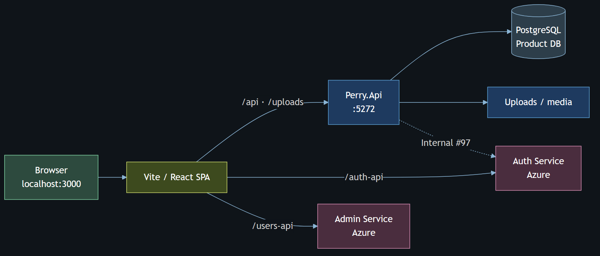

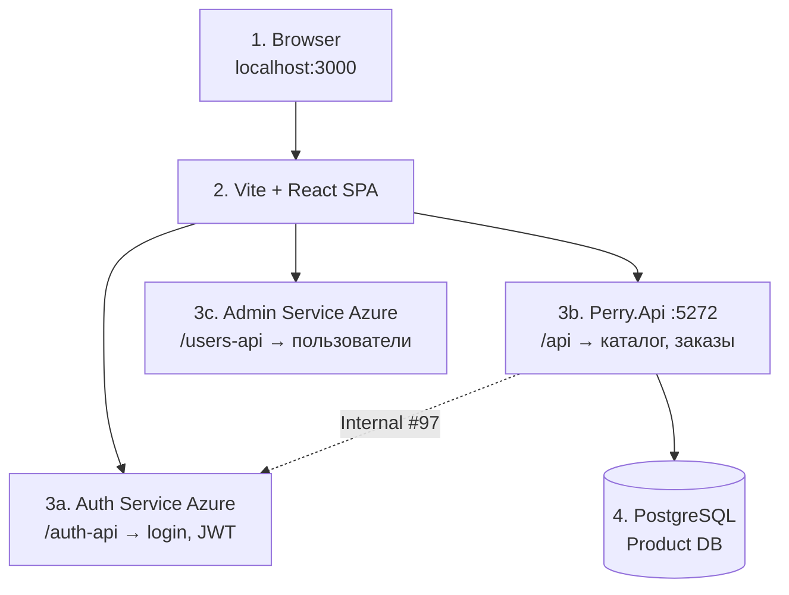

### Зачем так устроено

Интернет-магазин нельзя честно уместить в один сервис «и логин, и каталог, и админ-юзеры»:

- **Auth** отвечает за личность: регистрация, пароль, выпуск JWT.  
- **Product (я)** отвечает за торговлю: товары, цены, корзина, заказ.  
- **Admin Service** (не мой доклад) — CRUD пользователей для админки.

Если хранить Users и пароли в Product, придётся дублировать безопасность Auth и путаться с FK. Команда выбрала разделение (**#94**): в Product **нет таблицы Users**.

### Что происходит, когда пользователь открывает сайт

1. Браузер грузит React с `:3000`.  
2. Каталог запрашивается как `/api/products` → Vite **проксирует** на мой Api `:5272`.  
3. Логин идёт на `/auth-api/...` → **не** на мой Api, а на Azure Auth.  
4. После логина фронт кладёт JWT в storage и дальше шлёт его мне в заголовке `Authorization: Bearer …`.  
5. Я проверяю подпись токена тем же секретом, что у Auth, и выполняю заказ/wishlist от имени `UserId` из claims.

**Mobile:** часто ходит на `:5272` **напрямую** (без Vite). Контракт тот же: `/api/...` + Bearer.

---

## Слайд 2 — Куда уходит каждый URL (прокси)

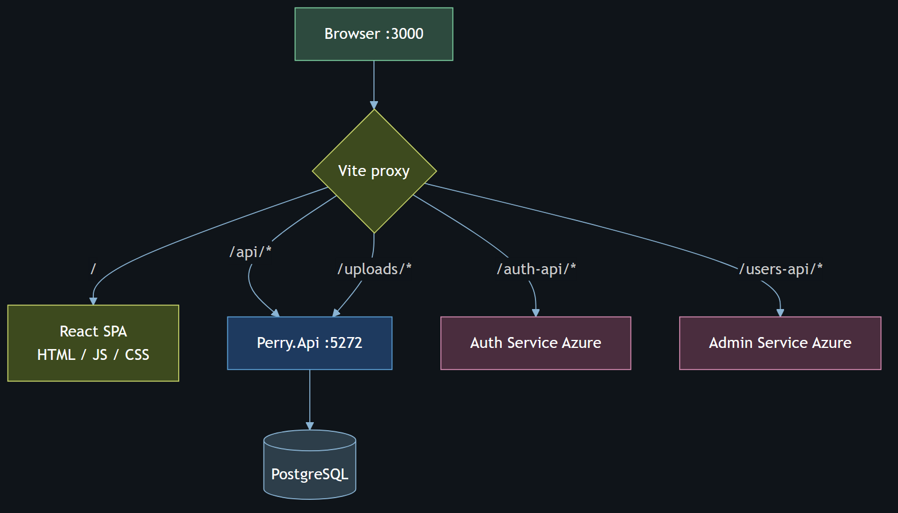

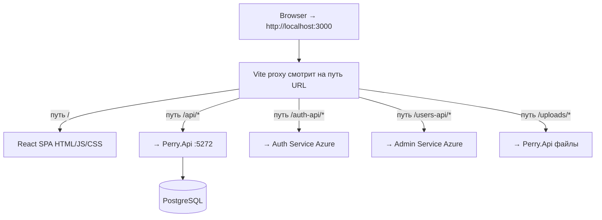

### Зачем proxy

Браузер запрещает «просто так» ходить с `localhost:3000` на чужой Azure-домен (CORS). В **dev** Vite делает вид, что всё same-origin:

| Путь на :3000 | Реальный сервер | Зачем тебе знать |
|---------------|-----------------|------------------|
| `/api/*` | **Perry.Api :5272** | Твой основной трафик |
| `/uploads/*` | **Perry.Api** | Картинки с диска API |
| `/auth-api/*` | Auth Azure | Логин — не ты |
| `/users-api/*` | Admin Service | Админка Users — не ты |

На проде URL могут быть абсолютными через env (`VITE_*`), но **смысл тот же**: каталог всегда бьёт в Product.

**Ошибка новичка:** слать `POST /api/auth/login` на `:5272`. У Product **нет** login — будет 404. Login только на Auth.

---

## Слайд 3 — Структура solution (слои кода)

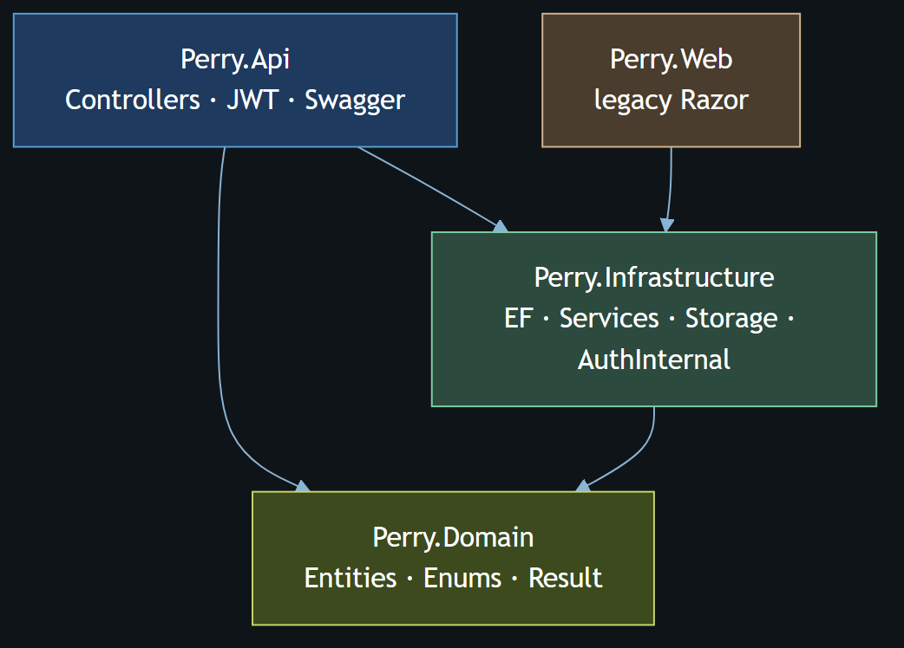

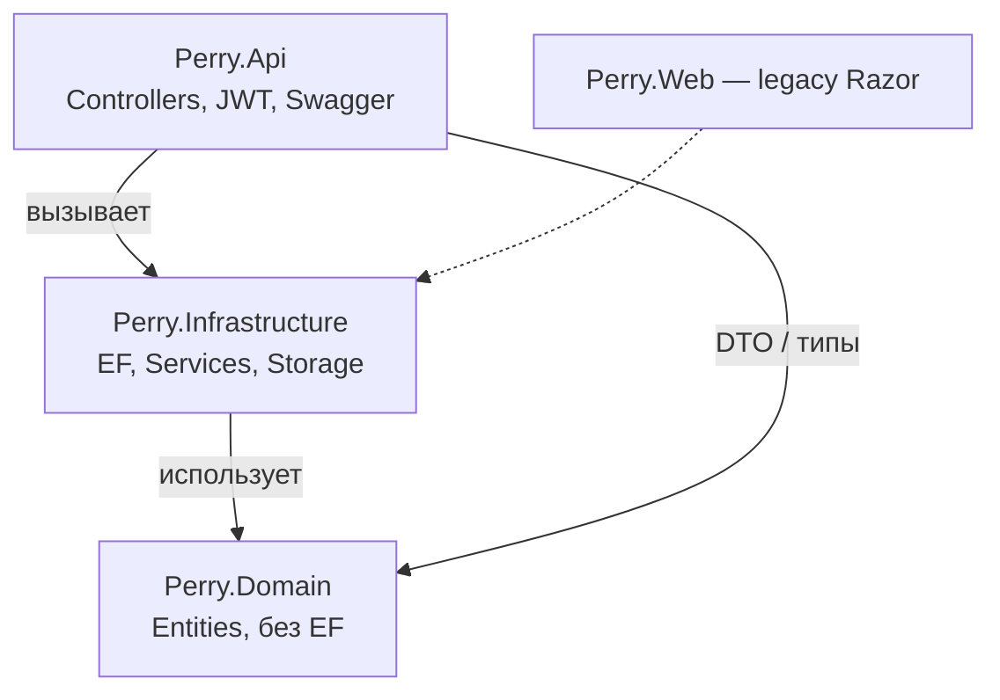

### Зачем слои (простыми словами)

| Проект | Аналогия | Что внутри |
|--------|----------|------------|
| **Perry.Api** | «Окно кассы» | HTTP: Controllers принимают JSON, отдают JSON. Здесь JWT, CORS, Swagger, `Program.cs`. |
| **Perry.Domain** | «Словарь бизнеса» | Классы `Product`, `Order`, `Cart`… **без** ссылок на EF. Чистые правила «что такое заказ». |
| **Perry.Infrastructure** | «Склад и бухгалтерия» | `AppDbContext`, Services (`CartService`, `OrderService`…), файлы uploads, клиент Internal Auth. |
| **Perry.Web** | Старая витрина | Razor — для защиты **не обязателен**. |

**Правило:** контроллер **не** пишет SQL и не считает скидки сам. Он вызывает Service → Service через EF пишет в Postgres.

**Где смотреть в репо:**

- `src/Perry.Api/Program.cs` — сборка приложения, migrate, seeder  
- `src/Perry.Api/Controllers/*.cs` — маршруты  
- `src/Perry.Api/Auth/AuthClaims.cs` — как достаём `UserId` из JWT  
- `src/Perry.Infrastructure/Persistence/` — DbContext, миграции  
- `src/Perry.Infrastructure/Services/` — бизнес-логика  

---

## Слайд 4 — Слой базы данных

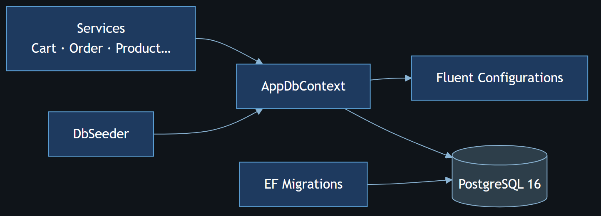

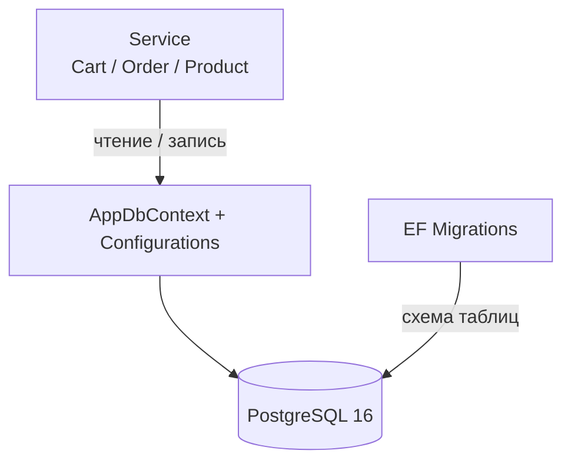

### Как это работает на практике

1. В `.env` лежит `ConnectionStrings__DefaultConnection` (Docker Postgres или Supabase).  
2. При старте Api EF делает **`MigrateAsync`**: схема БД догоняет код.  
3. **`DbSeeder`** (Development) кладёт категории, товары, иногда заказы; фото могут браться из DummyJSON — чтобы на демо не было серых квадратов.  
4. Сервисы получают `AppDbContext` через DI (scoped на запрос).

### Почему нет Users (#94) — важнейший тезис

Раньше в Product были сущности пользователя. Их **убрали**:

- пароли и email «истины» — у Auth;  
- в `Order`, `WishlistItem`, `ProductReview` остаётся поле **`UserId` (Guid)**;  
- значение берётся из JWT (`sub`), а не из query `?userId=` (это закрыло дыру безопасности — **#73**).

**Аналогия:** в магазине на кассе не хранят паспортные столы граждан — хранят номер клиента и чеки. Паспорт выдал МВД (Auth).

### Главные таблицы «витринного» мира

| Область | Сущности | Зачем |
|---------|----------|--------|
| Каталог | Category (дерево), Product, Images, Attributes, About | Home, list, PDP |
| Корзина | Cart, CartItem | гость + пользователь |
| Заказы | Order, OrderItem | checkout, «мои заказы» |
| Отзывы | ProductReview (+ tags…) | рейтинг и тексты |
| Прочее | WishlistItem, StockNotifyRequest | избранное, «сообщить о наличии» |

---

## Слайд 4b — Миграция на PostgreSQL (#A08)

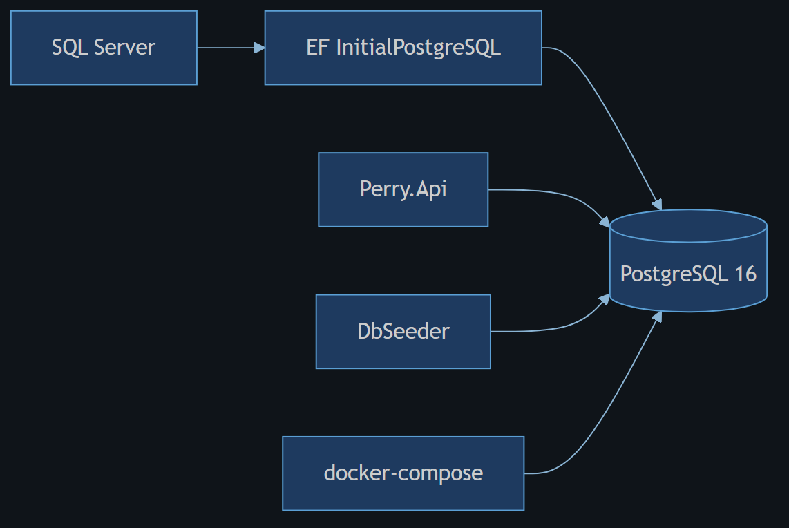

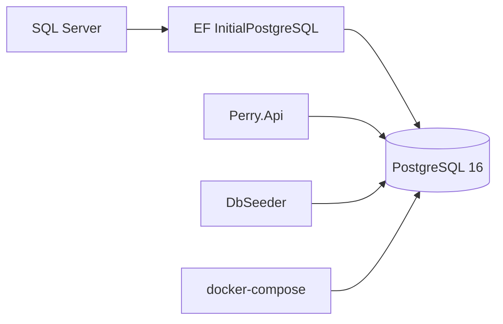

**Зачем рассказывать:** это видимый инженерный вклад. Ушли с LocalDB/SQL Server на PostgreSQL 16 + Npgsql, чтобы одинаково жить в Docker, CI и (опционально) Supabase. На защите: «одна миграция `InitialPostgreSQL`, compose поднимает Postgres, Api мигрирует при старте».

---

## Слайд 5 — Маршруты API (что показывать)

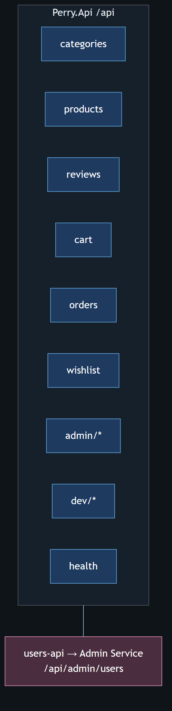

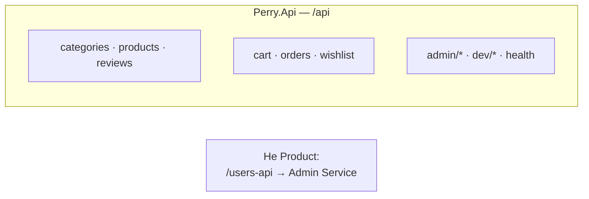

### Публичное (часто без токена)

| Метод | Путь | Смысл простыми словами |
|-------|------|------------------------|
| GET | `/api/health` | «Сервис и БД живы?» |
| GET | `/api/categories` | Дерево категорий для меню/Home |
| GET | `/api/products?page&pageSize&sort&search&categoryId&…` | Витрина-список + facets |
| GET | `/api/products/{id}` | Карточка товара (PDP): галерея, related, отзывы |

Гость **должен** видеть каталог без логина — иначе магазин мёртв.

### С токеном покупателя (Bearer)

| Метод | Путь | Смысл |
|-------|------|--------|
| * | `/api/cart…` | Корзина; query `sessionId` для гостя |
| POST | `/api/cart/merge` | После login склеить гостевую корзину с user |
| POST | `/api/orders/checkout` | Оформить заказ |
| GET | `/api/orders` | Мои заказы |
| * | `/api/wishlist…` | Избранное |
| POST | `/api/reviews` | Написать отзыв |
| GET | `/api/reviews/me` | Мои отзывы |
| POST | `/api/products/{id}/notify` | Notify when available |

### На слайде есть `admin/*` / `dev/*` — что сказать

«В том же Api есть admin-ветки и DEV-login — ими в этом докладе не занимаюсь; зона админки у другого отчёта. Я фокусируюсь на покупательских маршрутах и `/api/health`.»

Swagger (`:5272/swagger`) — лучший живой слайд: открой `GET /products`, потом с Authorize — checkout.

---

## Слайд 6 — Путь одного HTTP-запроса

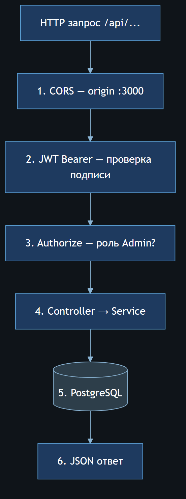

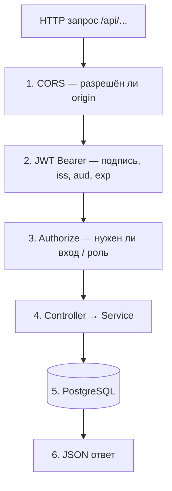

### Разбор для себя (чтобы не путаться на вопросах)

1. **CORS**  
   Браузер с `:3000` / Expo `:8081` имеет право вызвать Api. Без CORS preflight упадёт ещё до контроллера. Mobile native CORS не использует — там другой networking.

2. **Authentication (JWT)**  
   Если заголовок `Authorization` есть — middleware проверяет:
   - подпись **HS256** секретом `Jwt__SigningSecret` (тот же, что у Auth);  
   - Issuer ≈ `Perry.AuthService`;  
   - Audience ≈ `Perry.Client`;  
   - срок `exp`.  
   Плохой токен → **401**.  
   Для публичного GET каталога токен **не обязателен**.

3. **Authorization**  
   Атрибут `[Authorize]` на checkout/wishlist/reviews create: «кто-то вошёл».  
   Политика Admin — для админ-операций (не акцент).

4. **Controller**  
   Парсит query/body, достаёт `UserId` через `AuthClaims.GetUserId(User)`, зовёт Service.

5. **Service + EF**  
   Бизнес-правила: хватает ли stock, уникален ли отзыв, как merge корзин.

6. **Ответ**  
   JSON DTO. Ошибки: 404 «не найдено», 400 валидация, тело часто с `error` / `message`.

**Типичный баг на демо:** секрет в `.env` Product ≠ секрет Auth → все Bearer 401. Лечится сверкой `Jwt__SigningSecret`.

---

## Слайд 7 — Три потока Auth (что моё)

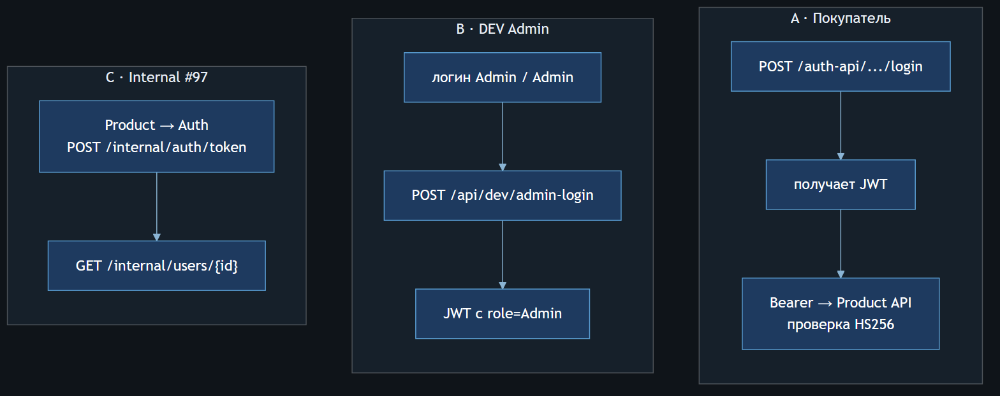

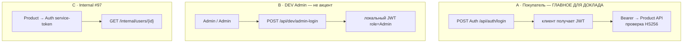

### Поток A — покупатель (разжёвано)

1. UI показывает форму логина.  
2. Фронт **не** зовёт Product — зовёт Auth: email/password.  
3. Auth отвечает access token (JWT). Внутри claims: кто пользователь (`sub`), иногда email, role.  
4. Фронт сохраняет токен.  
5. Любой запрос «от моего имени» к Product:  
   `Authorization: Bearer eyJ…`  
6. Product:
   - проверяет подпись общим секретом (**#95**);  
   - `AuthClaims.GetUserId` читает `sub` (запасные имена claims — на случай разного формата токена);  
   - дальше в SQL пишется этот Guid.

Код (идея):

```csharp
// AuthClaims.GetUserId — читаем sub / NameIdentifier / userId …
var userId = AuthClaims.GetUserId(User);
if (userId is null) return Unauthorized();
```

### Поток B — DEV Admin

Только Development: быстрый вход в админку без Azure. **На комиссии:** «есть для локальной отладки админки, в покупательском сценарии не использую».

### Поток C — Internal (#97)

Иногда нужен **имя** покупателя в заказе, а Users-таблицы нет. Product как сервис:

1. `POST {Auth}/internal/auth/token` с `serviceName` + credential (plaintext из `.env`, **не** hash).  
2. С service JWT: `GET /internal/users/{id}`.  
3. Подставляет display name в ответ/заказ.

Это **server-to-server**, браузер сюда не ходит. Секреты не на слайды.

---

## Слайд 8 — Микросервисы Auth ↔ Product

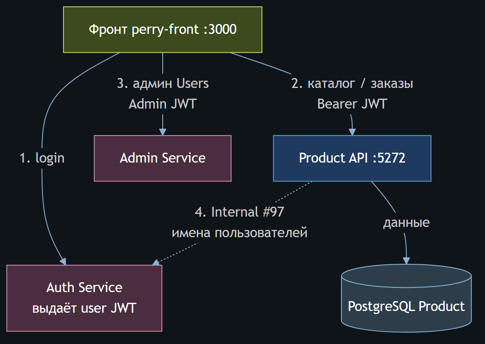

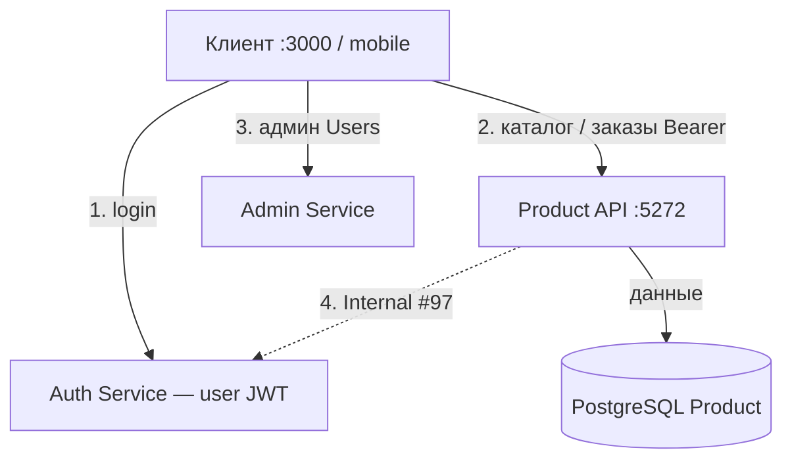

### Что запомнить назубок

| Вопрос комиссии | Короткий ответ |
|-----------------|----------------|
| Кто выдаёт JWT? | Auth Service |
| Кто хранит товары и заказы? | Product + PostgreSQL (**я**) |
| Где Users? | В Auth / Admin Service, **не** в Product DB |
| Как связаны сервисы? | Общий HS256 secret + (опц.) Internal API |
| Что сделал я по стыку? | #94 Users out · #95 валидация JWT · AuthClaims · Internal client |

Слайд 13 — хороший «центр» доклада: три стрелки от FE, ты указываешь на синий Product.

---

## Слайд 9 — Корзина → заказ (главный сценарий)

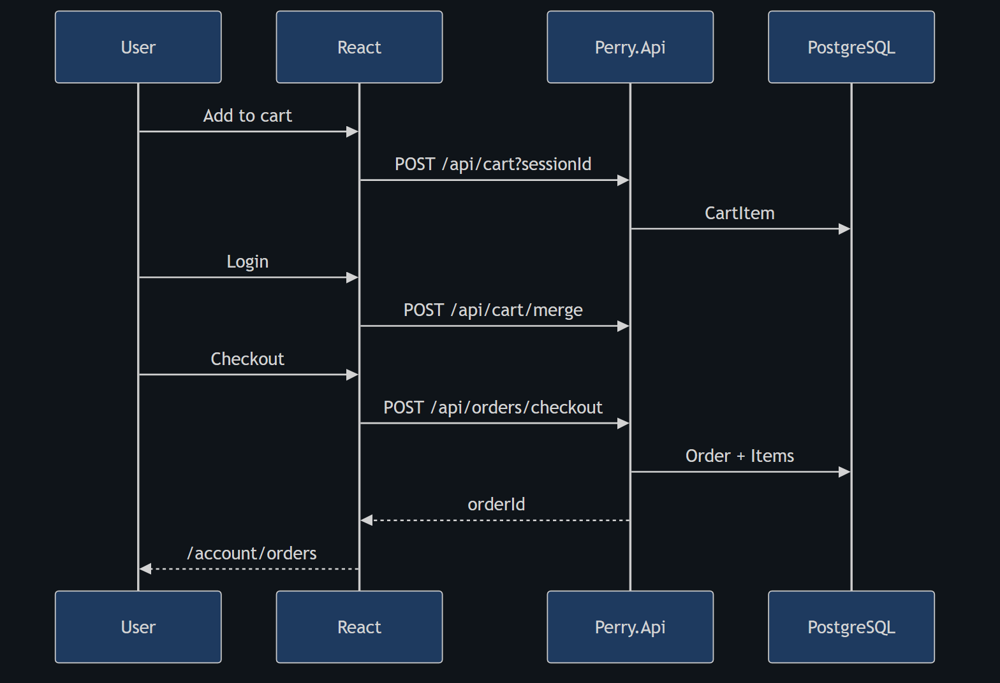

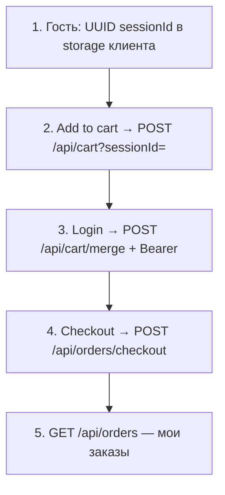

### Зачем `sessionId` (часто спрашивают)

Пока человек **не** вошёл, у нас нет `UserId`. Но корзину терять нельзя:

1. Клиент генерирует UUID один раз (`perry_cart_session` / аналог) и шлёт `?sessionId=` на cart API.  
2. В БД строки корзины висят на этой сессии.  
3. После login вызывается **`POST /api/cart/merge`** с телом `{ sessionId }` и Bearer: сервер переносит позиции «на пользователя».  
4. Checkout читает корзину (уже user или ещё session — по реализации), создаёт `Order` + `OrderItem`, чистит корзину. В заказ пишутся `shippingAddress`, `paymentType`, `recipientName` (**#A05**), номер заказа (**#A12**), seller при необходимости (**#A11**), метка обновления (**#A10**).

**Без merge:** гость набрал товары → залогинился → пустая корзина → злость на демо. Merge — обязательный рассказ.

### Что лежит в checkout body (ориентир)

```json
{
  "sessionId": "…-uuid-…",
  "shippingAddress": "…",
  "paymentType": "Cash",
  "recipientName": "…"
}
```

Ответ — созданный заказ (id / orderNumber). Дальше UI открывает «Мои заказы».

---

## Слайд 10 — Каталог глазами API

Отдельной PNG нет — логика на слайде 5 + демо Swagger.

### Список товаров

Клиент: `GET /api/products?page=1&pageSize=20&sort=newest&categoryId=…&search=…&brands=…`

Сервер:

1. Фильтрует/сортирует в EF.  
2. Считает пагинацию (`total`, `totalPages`).  
3. Часто отдаёт **`facets`** — какие бренды/цвета/размеры ещё доступны (для фильтров UI).  
4. У каждого item: `id`, `name`, `brand`, `price`, `oldPrice`, `imageUrl`, рейтинг…

### Карточка товара (PDP)

`GET /api/products/{id}` — тяжёлый JSON: описание, stock, attributes, aboutItems, images[], reviews, related[], saleRelated[].

### Медиа

- Абсолютный `https://…` (DummyJSON CDN и т.п.) — отдаём как есть.  
- Относительный `/uploads/…` — файл с диска Api; клиент склеивает с origin `:5272`.

**Фраза:** «Каталог публичный; персональные действия — только с JWT.»

---

## Слайд 11 — Вклад по Trello Done (бэкенд)

Ниже — **твои** закрытые карточки (участник Сергей Черныш, колонка Done, срез 2026-10-03). На защите не зачитывай всё: пройди **группы** и назови 2–3 номера из каждой.

### 11.1. Фундамент

| # | Суть | Ссылка |
|---|------|--------|
| **#1** | Solution Api / Domain / Infrastructure | [карточка](https://trello.com/c/zvHHwEVX) |
| **#2** | EF модель и миграции | [карточка](https://trello.com/c/cUK22DDD) |
| **#3** | DbSeeder каталога | [карточка](https://trello.com/c/gw6UruV1) |
| **#5** | Docker Compose + env | [карточка](https://trello.com/c/0bJvprYW) |
| **#A08** | SQL Server → PostgreSQL | [карточка](https://trello.com/c/ORMRprbu) |
| **#A02** | Merge веток / миграции | [карточка](https://trello.com/c/BgOTO4i6) |
| **#A06** | `/api/health` | [карточка](https://trello.com/c/GuHXZqMd) |

**Смысл для слушателя:** «С нуля подняли слои .NET, модель данных, сидер, Docker и переехали на Postgres.»

### 11.2. Каталог, корзина, заказы

| # | Суть | Ссылка |
|---|------|--------|
| **#71** | REST categories/products | [карточка](https://trello.com/c/ldmk2ZKn) |
| **#72** | REST cart + checkout | [карточка](https://trello.com/c/zQTnIfxL) |
| **#73** | JWT вместо query userId | [карточка](https://trello.com/c/ug9ctcO9) |
| **#76** | Swagger контракты | [карточка](https://trello.com/c/QCQIOeSA) |
| **#A03** | Seed заказов | [карточка](https://trello.com/c/wBwWx2mO) |
| **#A05** | shipping / paymentType | [карточка](https://trello.com/c/GcxLPwgF) |
| **#A10** | last update заказа | [карточка](https://trello.com/c/ZBJZpgnW) |
| **#A11** | Seller | [карточка](https://trello.com/c/BvEAQHah) |
| **#A12** | orderNumber | [карточка](https://trello.com/c/cMuMpoyL) |
| **#A13** | notify при смене статуса | [карточка](https://trello.com/c/rDDR1nee) |
| **#90** | Statistics API | [карточка](https://trello.com/c/Q6RN6fbS) |
| **#91** | Wishlist | [карточка](https://trello.com/c/Z7Gti7mz) |
| **#30** | Notify when available (BE) | [карточка](https://trello.com/c/vGukVFQZ) |

**Смысл:** «Полный покупательский контур магазина на API.»

### 11.3. Отзывы

| # | Суть | Ссылка |
|---|------|--------|
| **#34** | Reviews UX+API база | [карточка](https://trello.com/c/mZEblhPK) |
| **#99** | Контракт POST /reviews | [карточка](https://trello.com/c/OlAEuFoq) |
| **#100** | AuthClaims + Authorize | [карточка](https://trello.com/c/z9oM60XK) |
| **#101** | Unique + пересчёт рейтинга | [карточка](https://trello.com/c/lTtOFXBU) |
| **#102** | GET /reviews/me | [карточка](https://trello.com/c/W311ZwvW) |
| **#104** | Теги | [карточка](https://trello.com/c/79O9FVO7) |

**Смысл:** «Отзыв нельзя подделать чужим userId; один отзыв на товар; рейтинг товара пересчитывается.»

### 11.4. Стык Auth + почта

| # | Суть | Ссылка |
|---|------|--------|
| **#94** | Remove Users из Product | [карточка](https://trello.com/c/NCWUFlqw) |
| **#95** | JWT secret / claims / Internal | [карточка](https://trello.com/c/T28F0b7e) |
| **#15** | Auth-токены в БД | [карточка](https://trello.com/c/bkQFgXb0) |
| **#14** | Реальный SMTP | [карточка](https://trello.com/c/cUMg88Hg) |

### 11.5. Документация API для мобилки

| # | Суть | Ссылка |
|---|------|--------|
| **MB01** | Как подключить Login/Main/List/PDP к бэку | [карточка](https://trello.com/c/aSQ3QDvN) |

### 11.6. Готовая фраза (40 сек)

«В Done по бэкенду: фундамент #1–#3 и PostgreSQL #A08; REST каталога и cart/checkout #71–#73; заказы #A05, #A10–#A13; wishlist #91 и notify #30; пакет отзывов #99–#104; вынос Users #94 и JWT-стык #95. Админ-UI в доклад не входит.»

### 11.7. Done у меня, но не акцент этого отчёта

Admin Orders **#93 / #A09**, admin-only **#A04 / #A07**, чистый FE **#29 / #40 / #103**, mobile UI, слайды PPTX — при вопросе: «делал(а), но зона админки/фронта, сейчас фокус Product API покупателя».

---

## 12. Стек (шпаргалка)

| Слой | Технология |
|------|------------|
| Runtime | .NET 8, ASP.NET Core Web API |
| ORM | EF Core 8 + Npgsql |
| БД | PostgreSQL 16 (Docker / Supabase) |
| Auth | JWT HS256, shared secret с Auth Service |
| Docs API | Swagger |
| Packaging | Docker Compose, GitHub Actions (build/test/gitleaks) |

Готовность Product (срез 02.10): **~85–90%** витринного контура.

---

## 13. Речь ~5–7 минут (привязка к слайдам)

| Время | Что говоришь | Слайд |
|-------|--------------|-------|
| 0:00–0:30 | Роль: Product API, не Auth, не админка | — |
| 0:30–1:30 | Три сервиса; я — каталог/заказы + Postgres | **1**, **8** |
| 1:30–2:20 | Proxy: `/api` ко мне, `/auth-api` к Auth | **2** |
| 2:20–3:20 | Слои Api/Domain/Infrastructure; нет Users | **3**, **4** |
| 3:20–4:20 | Pipeline CORS→JWT→Service; как читаем `sub` | **6**, **7** |
| 4:20–5:40 | sessionId → merge → checkout → мои заказы + демо | **9** + Swagger |
| 5:40–6:30 | Вклад Trello Done (группы) | **11** + **4b** |
| 6:30–7:00 | Вопросы; админку не раскрываю | — |

---

## 14. Демо-чеклист

```powershell
cd D:\Perry\My_Amazon2
# .env: ConnectionStrings + Jwt__SigningSecret
$env:ASPNETCORE_ENVIRONMENT='Development'
dotnet run --project src/Perry.Api --urls http://localhost:5272
```

| # | Действие | Успех |
|---|----------|--------|
| 1 | `GET /api/health` | 200 |
| 2 | `GET /api/products?page=1&pageSize=3` | items + картинки |
| 3 | `GET /api/categories` | дерево |
| 4 | `GET /api/products/{id}` | PDP |
| 5 | Login на Auth → Bearer | токен |
| 6 | cart add → merge → checkout | order id |
| 7 | `GET /api/orders` | список |
| 8 | Swagger Authorize | повторить 6–7 из UI |

---

## 15. Вопросы комиссии — развёрнутые ответы

**«Зачем три бэкенда?»**  
Разделение ответственности: личность (Auth), торговля (Product), админ-юзеры (Admin Service). Product не дублирует пароли.

**«Как узнаёте пользователя без таблицы Users?»**  
В JWT claim `sub` — Guid. `AuthClaims.GetUserId`. Пишем его в Order/Wishlist/Review.

**«Что будет, если подделать userId в query?»**  
Раньше так делали — закрыли **#73**. Сейчас userId из токена; чужой query игнорируется / не принимается.

**«Как связан секрет?»**  
Один HS256 `Jwt__SigningSecret` у Auth и Product. Issuer/Audience согласованы. Секрет только в env.

**«Что такое sessionId?»**  
Id гостевой корзины. После login — merge в user-корзину, иначе потеряем товары.

**«Где бизнес-логика?»**  
Не в контроллере — в Infrastructure Services + Domain. Контроллер — HTTP-адаптер.

**«Почему PostgreSQL?»**  
Командный стандарт, Docker, облако; миграция #A08 с SQL Server.

**«Internal Auth?»**  
Product как сервис получает service-token и читает профиль пользователя у Auth, не копируя Users к себе.

**«Админка?»**  
Отдельный доклад. В Api есть admin-эндпоинты, UI и Admin Service — не моя презентация сегодня.

**«Mobile?»**  
Тот же `/api` и JWT; URL `localhost` / `10.0.2.2` / LAN; инструкция MB01.

---

## 16. Чего не обещать

- «Я написал весь Auth» — нет, стык и валидация.  
- «Админка полностью моя» — вне скоупа.  
- «Все карточки Auth #96–#108 закрыты» — часть ещё у Auth; демо при этом работает.  
- Секреты `.env` на слайдах.

---

## 17. Файлы рядом (если нужен большой экран)

| Слайд | PNG |
|-------|-----|
| 1 Архитектура | `01_architecture-overview/diagram.png` |
| 2 Proxy | `02_architecture-request-flow/diagram.png` |
| 3 Solution | `03_backend-structure/diagram.png` |
| 4 БД | `04_backend-database-layer/diagram.png` |
| 4b PG | `14_changelog-illustrations/pg-migration-flow.png` |
| 5 Routes | `05_backend-routes/diagram.png` |
| 6 Request | `06_backend-request-flow/diagram.png` |
| 7 Auth flows | `07_backend-auth-flow/diagram.png` |
| 8 Microservices | `13_auth-microservices/diagram.png` |
| 9 Cart→Order | `12_frontend-cart-checkout-flow/diagram.png` |
| Все копии | `views_project/01-diagram.png` … |

Пересборка PNG: см. `project_defense/README.md` (`mmdc`).

---

*Документ: защита ITSTEP Perry · Product API без админки. Источники: `project_defense` диаграммы, Controllers/AuthClaims, Trello Done, `docs/стыки/AUTH-INTEGRATION.md`.*
